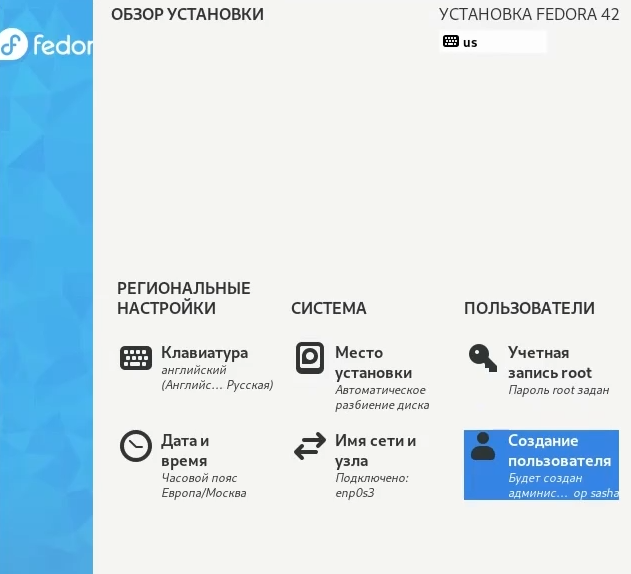
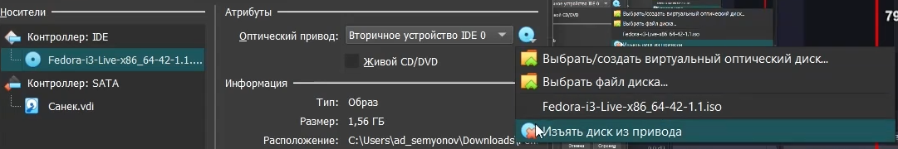
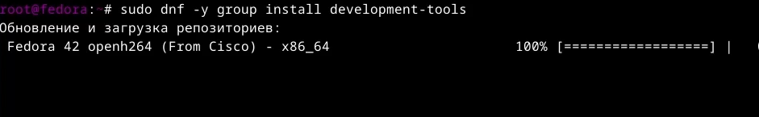
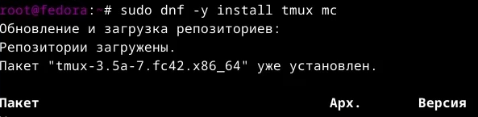
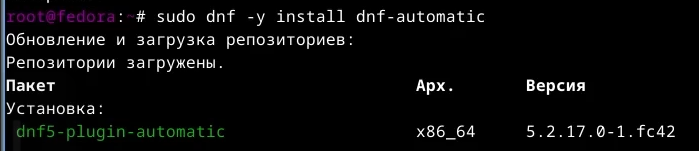
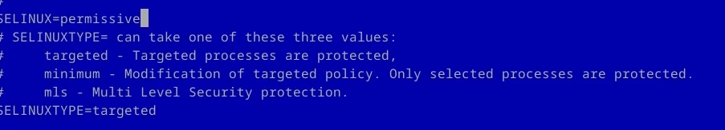
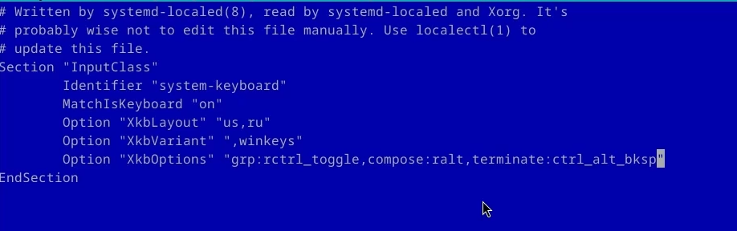
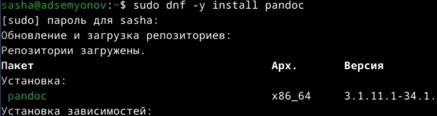
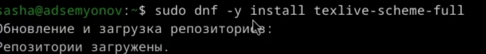
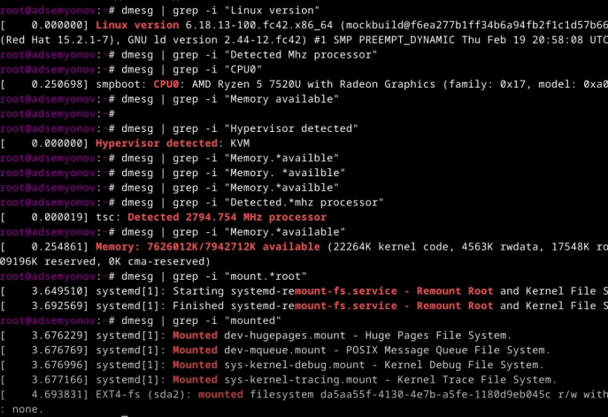

---
## Front matter
lang: ru-RU
title: Презентация по лабораторной работе №1
subtitle: Операционные системы
author:
  - Семёнов Александр Дмитриевич
institute:
  - Российский университет дружбы народов, Москва, Россия

## i18n babel
babel-lang: russian
babel-otherlangs: english

## Formatting pdf
toc: false
toc-title: Содержание
slide_level: 2
aspectratio: 169
section-titles: true
theme: metropolis
header-includes:
 - \metroset{progressbar=frametitle,sectionpage=progressbar,numbering=fraction}
---
# Информация

## Докладчик

 * Семёнов Александр Дмитриевич
 * НКАбд-05-25, Ст.билет: 1032252587
 * РУДН
 
## Цель работы

Приобретение практических навыков установки операционной системы на виртуальную машину.

## Задание 

1. Установка VirtualBox
2. Установка необходимого ПО
3. Первоначальная настройка

___

## Создание виртаульной машину

Установка системы (рис .1).

{#fig-001 width=40%}

##

Настройка системы (рис. 2).

{#fig-002 width=50%}

##

Отключение оптического привода после установки (рис. 3).

{#fig-003 width=70%}

##

Установим средства разработки (рис. 4).

{#fig-005 width=70%}

##

Обновим все пакеты (рис. 5).

{#fig-005 width=70%}

##

Прогарммы для удобства работы в консоли (рис. 6).

{#fig-006 width=70%}

##

Установим программное обеспечение (рис. 7).

{#fig-007 width=70%}

##

Отключение SELinux (рис. 8).

{#fig-008 width=70%}

##

Отредактируем конфигурационный файл ~/.config/sway/config.d/95-system-keyboard-config.conf (рис. 9).

{#fig-009 width=70%}

##

Отредактируем конфигурационный файл /etc/X11/xorg.conf.d/00-keyboard.conf (рис. 10).

{#fig-010 width=70%}

##

Средство pandoc для работы с языком разметки Markdown (рис. 11).

{#fig-011 width=70%}

##

Установим дистрибутив TeXlive (рис. 12).

{#fig-012 width=70%}

##

Можно использовать поиск с помощью grep (рис. 13).

{#fig-013 width=70%}

## Выводы

В ходе выполнения лабораторной работы я приборела навыки установки виртуальной машины на VirtualBox, установила ряд пакетов и настроила ОС для дальнейшей работы

:::
