---
## Author
author:
  name: Семёнов Александр Дмитриевич
  degrees: Student
  email: 1032252587@rudn.ru
  affiliation:
    - name: Российский университет дружбы народов
      country: Российская Федерация
      postal-code: 117198
      city: Москва
      address: ул. Миклухо-Маклая, д. 6

## Title
title: "Лабораторная работа №1"
license: "CC BY"
---

# Цель работы

Приобрести практические навыки установки операционной системы на виртуальную машину и настройки для дальнейших работ сервисо.

# Задание

Освоить процесс установки операционной системы **Linux** на виртуальную машину в **VirtualBox** и выполнить ее базовую настройку.

# Выполнение лабораторной работы

## Установка операционной системы.

Я создал виртуальную машину, и заранее добавил скачанный образ **Fedora sway** ([рис. @fig-001)].

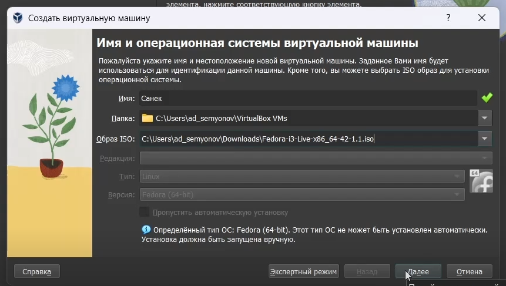{#fig-001  width=70%}

В терминале запустил **liveinst** ([рис. @fig-002]).

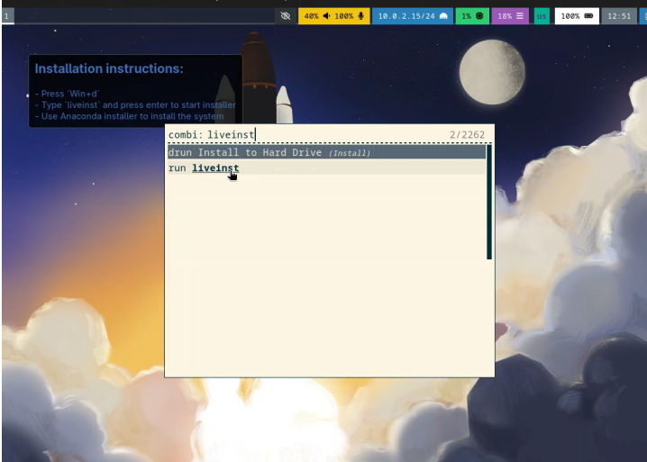{#fig-002  width=70%}

Выбрал язык, установил язык и пароль, а потом завершил установку **Fedora** ([рис. @fig-003]).

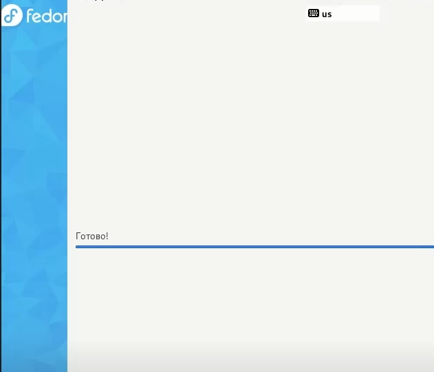{#fig-003  width=70%}

Я изъял оптический диск, так как он не удаляется автоматически ([рис. @fig-004)].

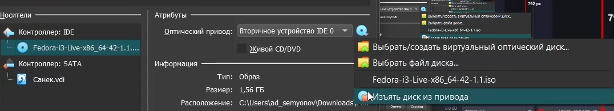{#fig-004  width=70%}

Потом я переключился на роль супер-пользователя и установил средства разработки ([рис. @fig-005)].

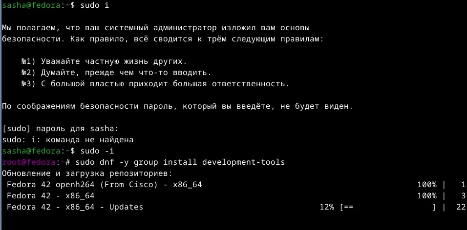{#fig-005  width=70%}

Ещё обновил все пакеты ([рис. @fig-006)].

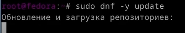{#fig-006  width=70%}

Установил программы для удобства работы в консоли и другой вариант консоли ([рис. @fig-007)].

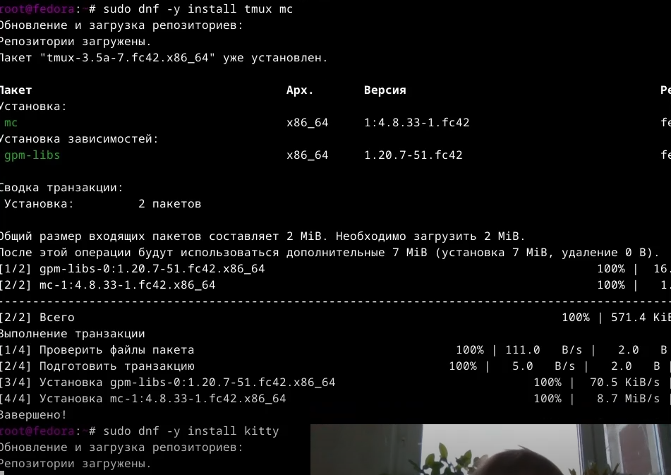{#fig-007  width=70%}

В файле **/ect/selinux/cinfig** я заменил значение **SELINUX** ([рис. @fig-008)].

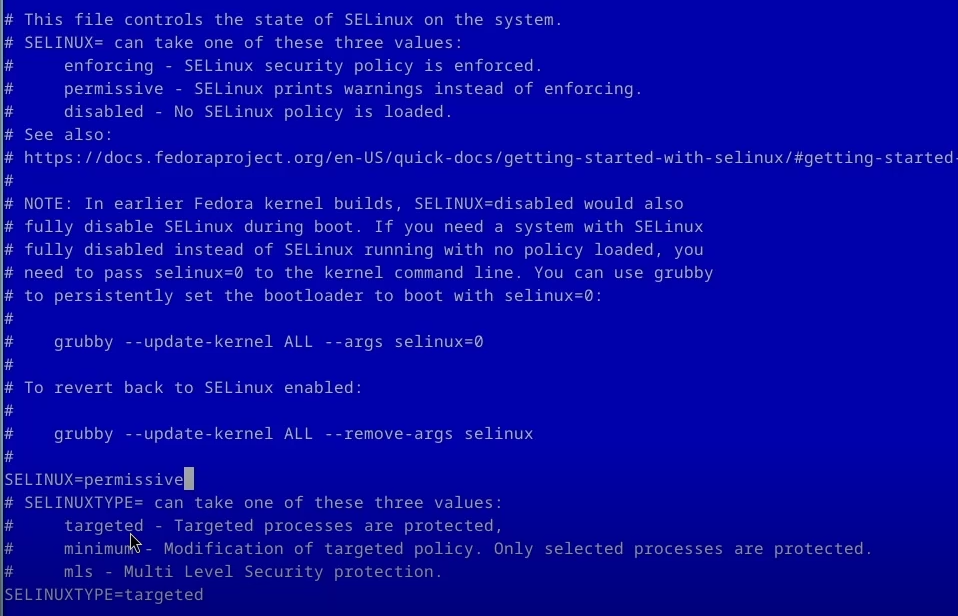{#fig-008  width=70%}

Перезагрузил машину ([рис. @fig-009)].

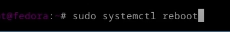{#fig-009  width=70%}

## Настройка клавиатуры.

Я зашел в **OC** под моей учётной записью, запустил терминал и запустил мультиплексор **tmux** ([рис. @fig-010)].

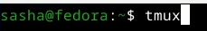{#fig-010  width=70%}

Затем я создал конфигурационный файл ([рис. @fig-011]).

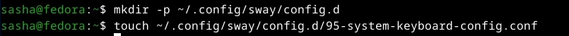{#fig-011  width=70%}

Отредактировал конфигурационный файл **95-system-keyboard-config.conf** ([рис. @fig-012]).

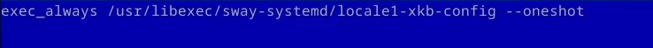{#fig-012  width=70%}

Потом я преключился на роль супер-пользователя ([рис. @fig-013]).

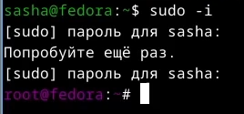{#fig-013  width=70%}

И отредоктировал еще один файл **00-keyboard.conf** ([рис. @fig-014]).

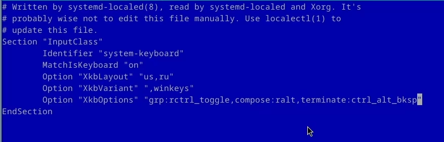{#fig-014  width=70%}

## Установка имени пользователя и название хоста.

Я запутсли мультиплексор **tmux** и переключился на роль супер-пользователя. Установил имя хоста и проверил, что все установлено верно ([рис. @fig-015]).

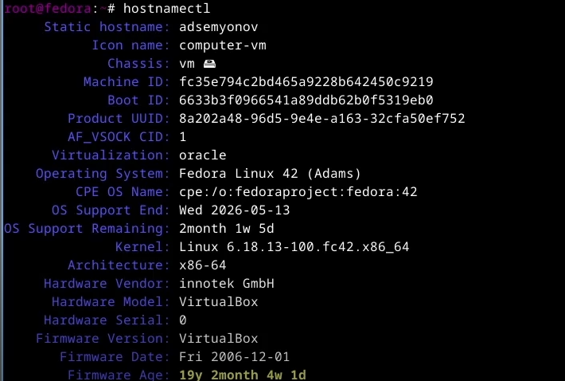{#fig-015  width=70%}

## Устанока программного обеспечения для создания документации.

С помощью менеджера пакетов я установил **pandoc** ([рис. @fig-016]).

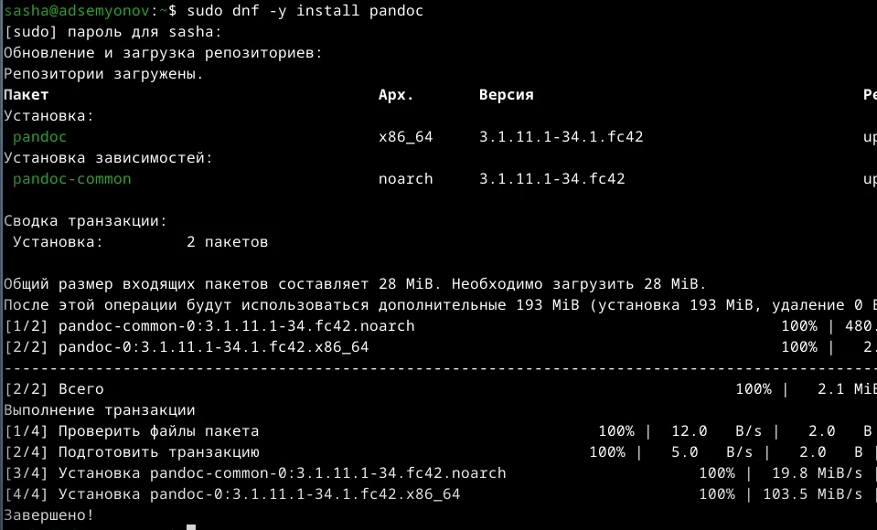{#fig-016  width=70%}

Потом я установил дистрибутив **TeXlive** ([рис. @fig-017]).

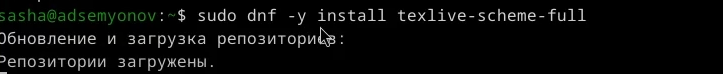{#fig-017  width=70%}

## Домашнее задание.

Я выполнил команду **dsmeg** с помощью **grep**, чтобы получить информацию про систему ([рис. @fig-018]).

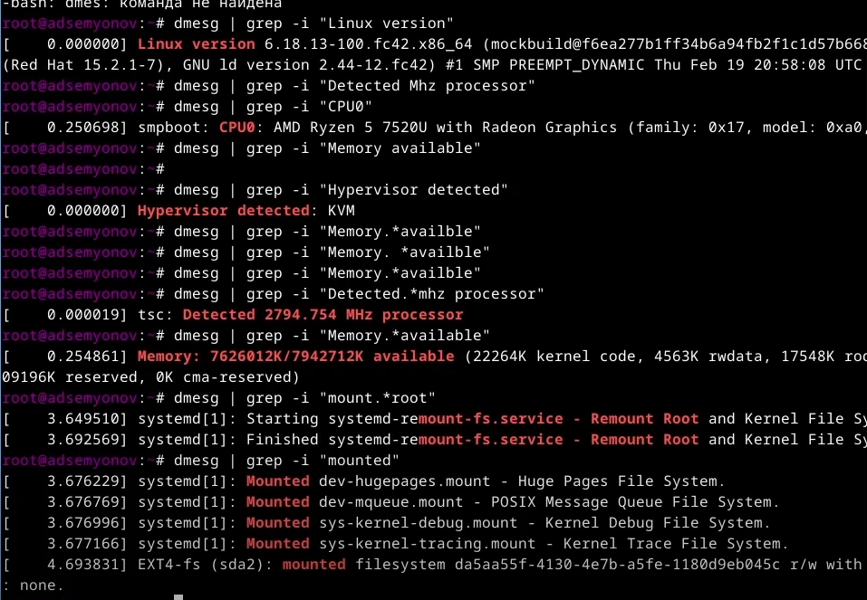{#fig-018  width=70%}

Результат:

* Версия ядра: **6.18.13-100.fc42.x86_64**

* Модель процессора: **AMD Ryzen 7 7520U with Radeon Graphics**

* Частота процессорая: **2794.754 MHz**

* Доступная память: **7626012K/7942712K**

* Тип гипервизора: **KVM**

* Тип файловой системы корневого раздела: **ext4**

* Последовательность монтирования файловых систем: **Huge Pages ->POSIX Message Queue -> Kernel Debug -> Kernel Trace -> FUSE Control ->корневой раздел (sda2)**

# Выводы

Я приобрел практические навыки установки операционной системы на виртуальную машину и минимальная настройка для дальнейшей работы.

# Список литературы{.unnumbered}

[ТУИС](https://esystem.rudn.ru/)
