---
## Author
author:
  name: Семёнов Александр Дмитриевич
  degrees: Student
  email: 1032252587@rudn.ru
  affiliation:
    - name: Российский университет дружбы народов
      country: Российская Федерация
      postal-code: 117198
      city: Москва
      address: ул. Миклухо-Маклая, д. 6
## Title
title: Презентация по лабораторной работе №2
subtitle: Работа с системой контроля git
license: CC BY
date: today
date-format: "2026-03-07" # Example: 2025-09-06
---

# Информация

## Докладчик

  * Семёнов Александр Дмитриевич
  * НКАбд-05-25
  * профессор кафедры теории вероятностей и кибербезопасности
  * Российский университет дружбы народов им. П. Лумумбы
  * [1032252587@rudn.ru](mailto:1032252587@rudn.ru)
  * <https://github.com/rudn103225>

# Вводная часть

## Цель работы

- Изучить идеологию и применение средств контроля версий.
- Освоить умения по работе с **git**.

## Задания

- Создать базовую конфигурацию для работы с **git**.
- Создать ключ **SSH**.
- Создать ключ **PGP**.
- Настроить подписи **git**.
- Зарегистрироваться на **Github**.
- Создать локальный каталог для выполнения заданий по предмету.

## Теоретическое введение 

Системы контроля версий (Version Control System, VCS) используются для организации совместной работы коллектива над общим проектом. Как правило, основная ветка разработки хранится в репозитории — локальном или удаленном, — к которому организован доступ всех участников. Когда разработчики вносят правки, VCS позволяет регистрировать эти изменения, объединять результаты работы разных специалистов, а при необходимости — выполнять возврат к любой из более ранних версий проекта.

---

В классической модели контроля версий применяется централизованный подход: все файлы хранятся в едином репозитории, а управление версиями обеспечивается выделенным сервером. Участник проекта перед началом работы с помощью специальных команд запрашивает актуальную или нужную ему версию файлов. Завершив внесение правок, он отправляет обновлённую версию обратно в хранилище. При этом все предыдущие версии сохраняются в центральном репозитории, и к ним можно обратиться в любой момент. Чтобы экономить дисковое пространство, сервер может не сохранять полностью каждый изменённый файл, а применять дельта-компрессию — записывать только различия между последовательными версиями.

# Выполнение лабораторной работы

## Установка програмного обеспечения

Я установли **git** и **gh** ([рис. @fig-001]).

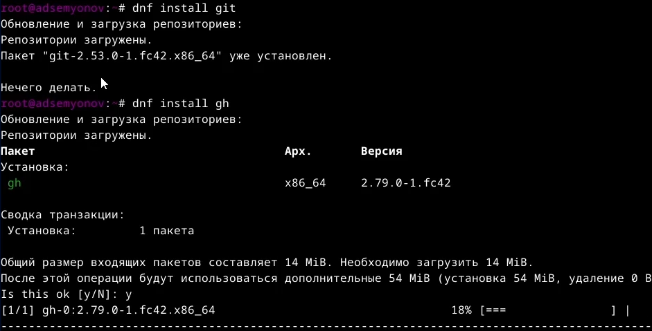{#fig-001 width=80%}

## Базовая настройка git

Я задал имя и email владельца репозитория, настроил **utf-8** в выводе сообщений в **git** задал имя начальной ветки **master**, параметр **autocrlf** и параметр **safecrlf** ([рис. @fig-002],[рис. @fig-003]).

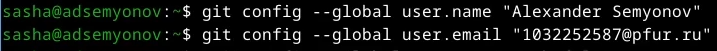{#fig-002 width=80%}
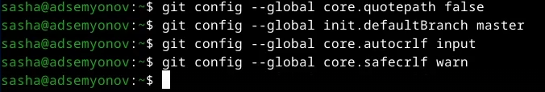{#fig-003 width=80%}

## Создание ключей SHH

Я создал ключи по алгоритму **rsa** и поставил размер **4096 бит**, а еще по алгоритму **ed25519** ([рис. @fig-004]).

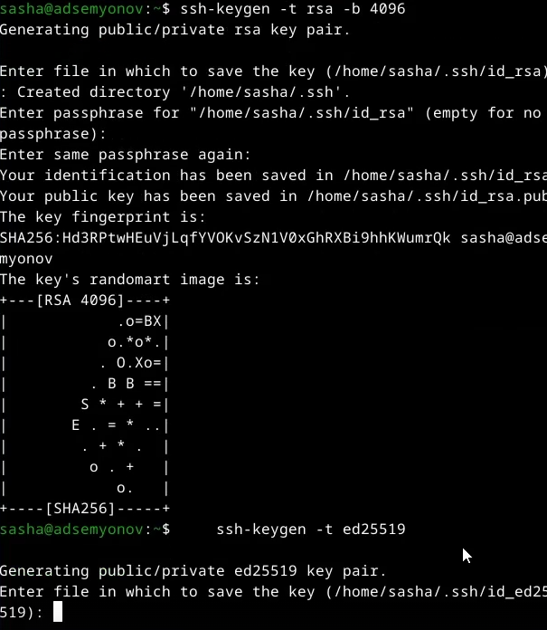{#fig-004 width=80%}

## Создание ключей PGP

Я сгенерировал ключ и выбрал необходимые опции ([рис. @fig-005]).

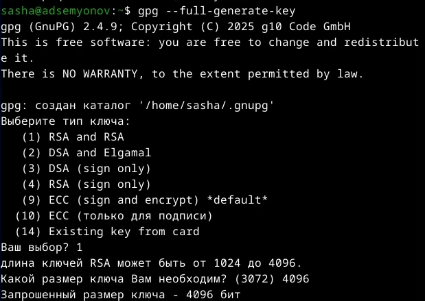{#fig-005 width=80%}

## Настройека github 

У меня есть учетная запись в **GitHub**. Я добавил туда свою почту ([рис. @fig-006]).

{#fig-006 width=80%}

## Добавление PGP ключа в GitHub

Я вывел список ключей и скопировал отпечаток приватного ключа. Свой сгенерированный **PGP** ключ я скопировал и вставила его в поле ввода в **GitHub** ([рис. @fig-007],[рис. @fig-008]).

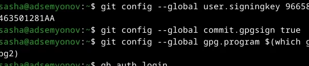{#fig-007 width=80%}

---

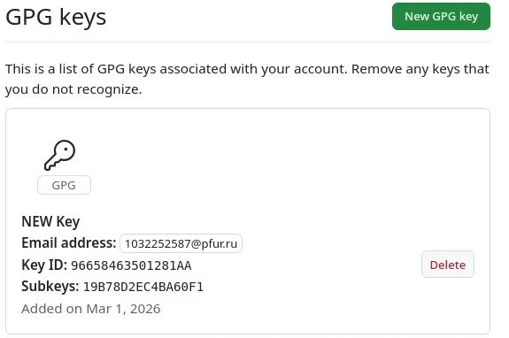{#fig-008 width=80%}

## Настройка gh

Я авторизовался через браузер, ответив до этого на вопросы ([рис. @fig-009]).

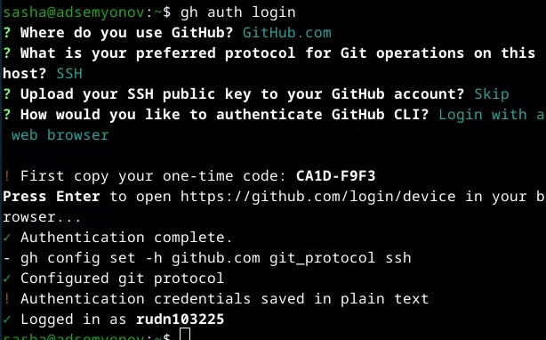{#fig-009 width=80%}

## Шаблон для рабочего пространства

Я создал репозиторий на основе шаблона по предмету **"Операционные системы"** ([рис. @fig-010]).

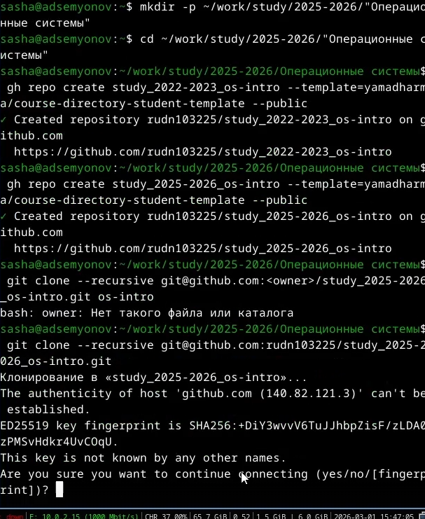{#fig-010 width=80%}

---

Я перешл в каталог курса, удалил лишнии файлы и создал необходимые каталоги ([рис. @fig-011]).

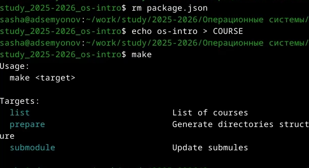{#fig-011 width=80%}

---

Я отправила файлы на сервер ([рис. @fig-012]).

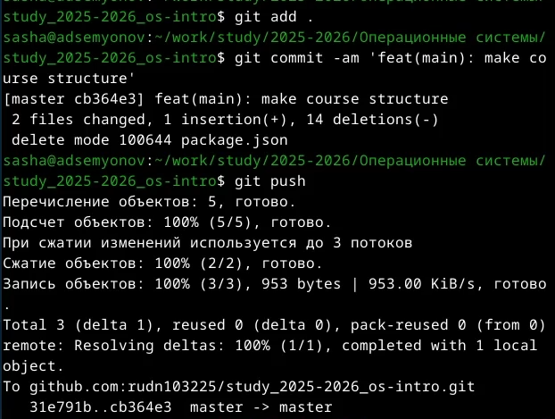{#fig-012 width=80%}

# Выводы

Я изучил идеологию и применение средств контроля версий и освоил умения по работе с **git**.

# Список литературы

[ТУИС](https://esystem.rudn.ru/course)
