## Title
title: "Лабораторная работа №2"
subtitle: "Архитектура Компьютера"
author: "Семёнов Александр Дмитриевич"
---

# Цель работы

Целью работы является изучение работы и применения средств контроля версий и освоение по работе с git.

# Задание

Создать базовую конфигурацию для работы с git, ключ ssh, ключ pgp, подписи git, локальный каталог для выполнения и прикрепления щаданий по предмету.

# Теоретическое введение

Системы контроля версий (Version Control System, VCS) используются для организации совместной работы коллектива над общим проектом. Как правило, освновная ветка разработки хранится в репозитории - локальном или удаленном, - к которому организован доступ всех участников. Когда разработчики вносят правки, VCS позволяет регистрировать эти изменения, объединять результаты работы разных специалистов, а при необходимости - выполнять возврат к любой из более ранних версий проекта.

В классической модели контроля версий применяется централизованный подход: все файлы хранятся в едином репозитории, а управление версиями обеспечивается выделенным сервером. Участник проекта перед началом работы с помощью специальных команд запрашивает актуальную или нужную ему версию файлов. Завершив внесение правок, он отправляет обновлённую версию обратно в хранилище. При этом все предыдущие версии сохраняются в центральном репозитории, и к ним можно обратиться в любой момент. Чтобы экономить дисковое простарнство, сервер может не сохранять полностью каждый изменённный файл, а применять дельта-компрессию - записывать только различия между последовательными верссиями.

# Выполнение лабораторной работы

1) Для начала работы переключимся на суперпользователя при помощи команды 'sudo -i' ([рис. @fig-001]).

{#fig-001 width=70%}

2) Установим git  при помощи команды 'dnf install git' ([рис. @fig-002]).

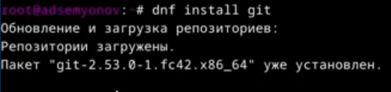{#fig-002 width=70%}

3) Установим gh при помощи команды 'dnf install gh' [(рис. @fig-003)].

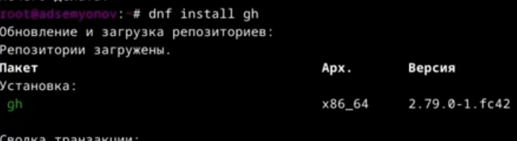{#fig-003 width=70%}

4) Зададим имя и email владельца репозитория с помощью команды 'git config --global user.name' и 'git config --global user.email' ([рис. @fig-004]).

{#fig-004 width=70%}

5) Настроим utf-8 в выводе ссобщений git командной 'git config --global core.quotepath false' ([рис. @fig-005]).

{#fig-005 width=70%}

6) Зададим имя начальной ветки (master) с помощью команды 'git config --global init.defualtBranch master' ([риc. @fig-006]).

{#fig-006 width=70%}

7) Настроим параметры autocrlf и safecrlf для корректной работы с окончанием строк ([рис. @fig-007)].

{#fig-007 width=70%}

8) Сгенерируем ключ ssh по алгаритму rsa с ключом размером 4096 бит ([рис. @fig-008]).

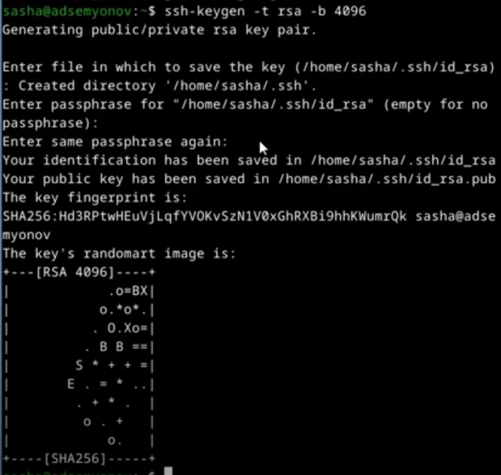{#fig-008 width=70%}

9) Сгенерируем ключ ssh по алгоритму ed25519 ([рис. @fig-009]).

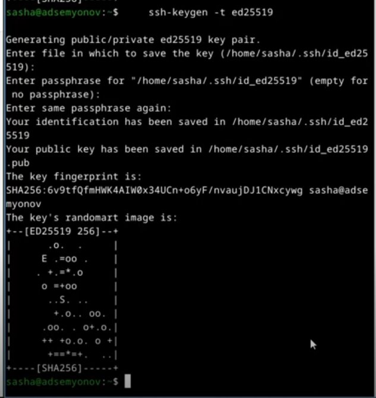{#fig-009 width=70%}

10) Теперь сгенирируем RGP ключ для подписи коммитов ([рис. @fig-010]).

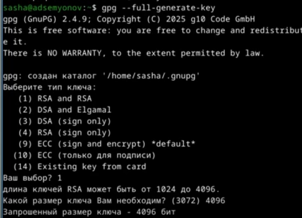{#fig-010 width=70%}

11) Выведем список ключей и скопируем отпечаток приватного ключа ([рис. @fig-011)].

{#fig-001 width=70%}

12) Скопируем сгенерированный ключ в буфер обмена ([рис. @fig-012]).

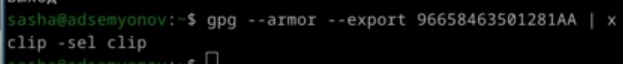{#fig-012 width=70%}

13) Используя введенный email, укажем git применять его при подписки коммитов ([рис. @fig-013]).

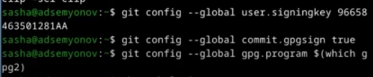{#fig-013 width=70%}

14) Авторизуемся на GitHub через gh ([рис. @fig-014]).

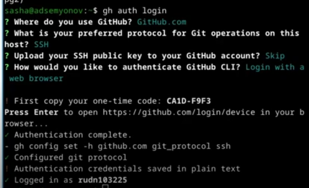{#fig-014 width=70%}

15) Создадим каталог для работы и перейдем в него ([рис. @fig-015]).

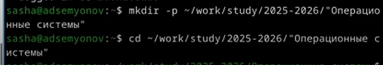{#fig-015 width=70%}

16) Создадим репозиторий на основе шаблона ([рис. @fig-016]).

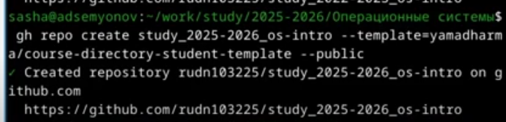{#fig-016 width=70%}

17) Выполним клонирование репозитория ([рис. @fig-017]).

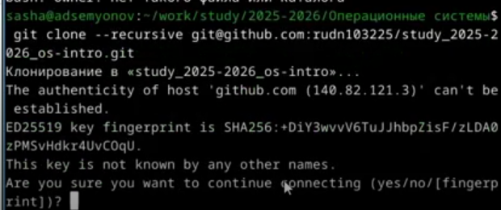{#fig-017 width=70%}

18) Перейдем в каталог курса ([рис. @fig-018]).

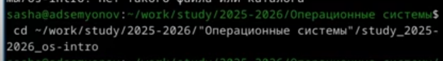{#fig-018 width=70%}

19) Удалим лишние файлы ([рис. @fig-019]).

{#fig-019 width=70%}

20) Создадим необходимые каталоги для лабораторных работ ([рис. @fig-020]).

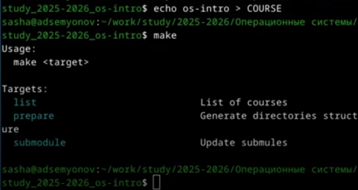{#fig-020 width=70%}

21) Продолжим создание дополнительных каталогов ([рис. @fig-021]).

{#fig-021 width=70%}

22) Отправим созданые файлы на сервер ([рис. @fig-022]).
 
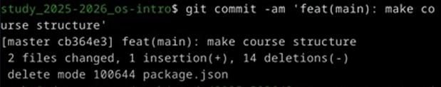{#fig-022 width=70%}

23) Затем выполним коммит с сообщением о проделанной работе ([рис. @fig-023]).

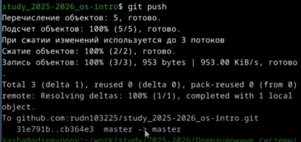{#fig-023 width=70%}

# Выводы
 
В результате выполнения лабораторной работыя приобрел навыки, необходимые для работы с git, настроил каталоги курса для дальнейшей работы, создал ssh и gpg ключи и авторизовался в gh.

# Список литературы

