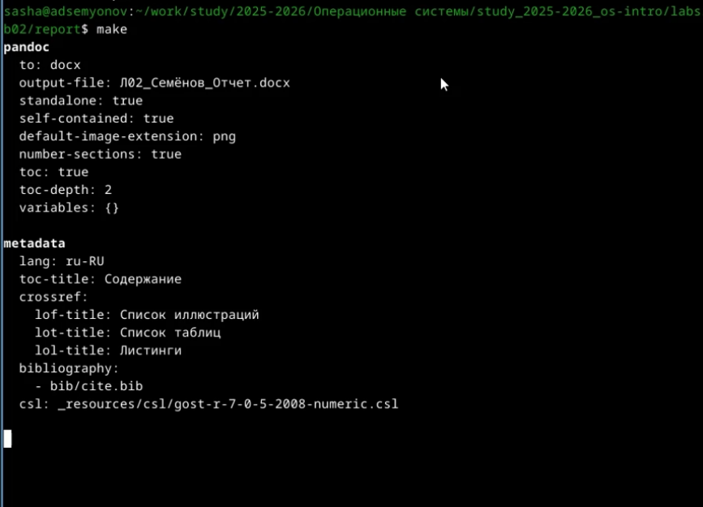
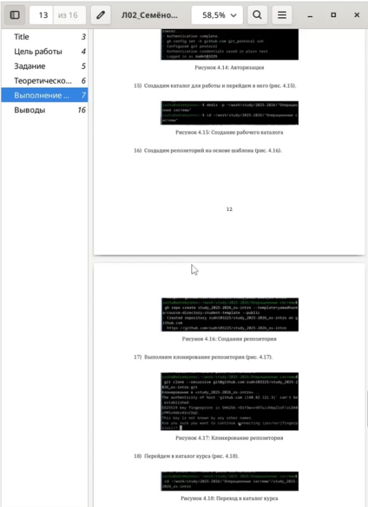

---
## Author
author:
  name: Семёнов Александр Дмитриевич
  degrees: Student
  email: 1032252587@rudn.ru
  affiliation:
    - name: Российский университет дружбы народов
      country: Российская Федерация
      postal-code: 117198
      city: Москва
      address: ул. Миклухо-Маклая, д. 6
## Title
title: Презентация по лабораторной работе №3
subtitle: Работа с Markdown
license: CC BY
date: today
date-format: "2026-03-07" # Example: 2025-09-06
---

# Информация

## Докладчик

  * Семёнов Александр Дмитриевич
  * Группа НКАбд-05-25, студент бакалавра
  * Российский университет дружбы народов им. П. Лумумбы
  * [1032252587@rudn.ru](mailto:1032252587@rudn.ru)
  * <https://github.com/rudn103225>

# Вводная часть

## Цель работы

Научиться оформлять отчёты с помощью легковесного яызка разметки **Markdown**.

## Задания 

Сделать отчёт по предыдущей лабораторной работе в формате **Markdown**.

## Теоретическое введение

Markdown — это облегчённый язык разметки, предназначенный для оформления текстовых документов с простым синтаксисом, который легко конвертируется в другие форматы, такие как HTML, PDF или DOCX. Основные элементы форматирования включают:

- **Заголовки** — создаются с помощью символа \# (например, `# Заголовок 1`, `## Заголовок 2`);
- **Выделение текста** — полужирное начертание (`**текст**`) и курсив (`*текст*`);
- **Списки** — маркированные (с помощью `*`, `+` или `-`) и нумерованные (с помощью цифр с точкой);
- **Блоки цитирования** — обозначаются символом `>`;
- **Ссылки** — формат `[текст ссылки](адрес)`;
- **Вставка кода** — ограждённые блоки с указанием языка (```` ```language ````);
- **Изображения** — ``;
- **Формулы** — поддерживаются LaTeX-синтаксис внутри `$$` или `\(...\)`.

---

Для обработки файлов в формате Markdown используется инструмент **Pandoc**, который позволяет преобразовывать `.md` файлы в `.pdf`, `.docx` и другие форматы. При необходимости для автоматизации процесса компиляции применяется **Makefile**.

---

# Выполнение лабораторной работы

## Лабораторная работы

Я изменли текст шаблона для лабораторной работы и скомпилировал его с помощью команды **make** ([рис. @fig-001]).

{#fig-001 width=100%}

---

После компиляции проверил как выклядят файлы ([рис. @fig-002]).

{#fig-002 width=100%} 

# Выводы

В процессе выполнения лабораторной работы я научился оформлять отчёты с помощью легковесного языка разметки **Markdown**.

# Список литературы

[ТУИС](https://esystem.rudn.ru/)


