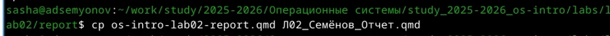
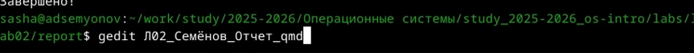
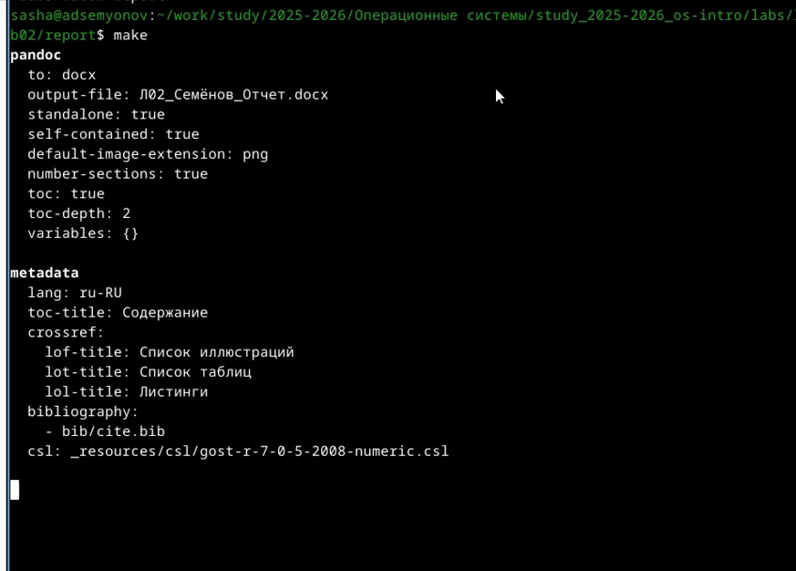
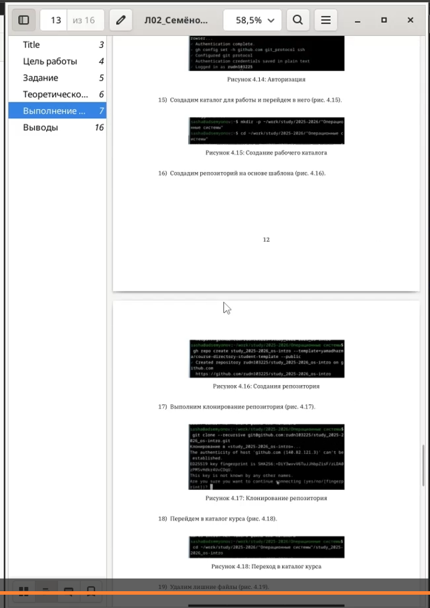

# Цель работы

Научиться оформлять отчёты с помощью легковесного языка разметки Markdown.

# Задание

Сделать отчёт по лабораторной работе №2 в формате Markdown и предоставить три формата: docx, pdf и md.

# Теоретическое введение

**Markdown** — это облегчённый язык разметки, предназначенный для оформления текстовых документов с простым синтаксисом, который легко конвертируется в другие форматы, такие как HTML, PDF или DOCX. Основные элементы форматирования включают:

- **Заголовки** — создаются с помощью символа \# (например, `# Заголовок 1`, `## Заголовок 2`);
- **Выделение текста** — полужирное начертание (`**текст**`) и курсив (`*текст*`);
- **Списки** — маркированные (с помощью `*`, `+` или `-`) и нумерованные (с помощью цифр с точкой);
- **Блоки цитирования** — обозначаются символом `>`;
- **Ссылки** — формат `[текст ссылки](адрес)`;
- **Вставка кода** — ограждённые блоки с указанием языка (```` ```language ````);
- **Изображения** — ``;
- **Формулы** — поддерживаются LaTeX-синтаксис внутри `$$` или `\(...\)`.

Для обработки файлов в формате Markdown используется инструмент Pandoc, который позволяет преобразовывать `.md` файлы в `.pdf`, `.docx` и другие форматы. При необходимости для автоматизации процесса компиляции применяется **Makefile**.

# Выполнение лабораторной работы

Я скопировал файл с шаблоном и переименовал его для удобства ([рис. @fig-001]).

{#fig-001 width=70%}

Я открыл скопированный файл с шаблоном с помощью команды **gedit** ([рис. @fig-002]).

{#fig-002 width=70%}
 
Я сделал отчёт по предыдущей работе и скомпилировал его с помощью команды **make** ([рис. @fig-003]).

{#fig-003 width=70%}

Потом я проверил как выглядит файл ([рис. @fig-004]).

{#fig-004 width=70%}

# Выводы

Я научился оформлять отчёты с помощью **Markdown**.

# Список литературы{.unnumbered}

[ТУИС](https://esystem.rudn.ru/)
