---
## Author
author:
  name: Семёнов Александр Дмитриевич
  degrees: Student
  email: 1032252587@rudn.ru
  affiliation:
    - name: Российский университет дружбы народов
      country: Российская Федерация
      postal-code: 117198
      city: Москва
      address: ул. Миклухо-Маклая, д. 6
## Title
title: Отчёт по лабораторной работе №4
subtitle: Установка и настройка Git и git-flow
license: CC BY
date: today
date-format: "2026-03-07" # Example: 2025-09-06
---

# Информация

## Докладчик

  * Семёнов Александр Дмитриевич
  * Группа НКАбд-05-25, студент бакалавра
  * Российский университет дружбы народов им. П. Лумумбы
  * [1032252587@rudn.ru](mailto:1032252587@rudn.ru)
  * <https://github.com/rudn103225>
  
# Вводная часть

## Цель работы

Получить навыки правильной работы с репозиториями git.

## Задание

* Выполнить работу для тестового репозитория 
* Преобразовать рабочий репозиторий в репозиторий с git-flow и conventional commits

## Теоретическое введение

Gitflow Workflow опубликована и популярована Винсентом Дриссеном.
Gitflow Workflow предполагает выстраивание строгой модели ветвления с учётом выпуска проекта.
Данная модель отлично подходит для организации рабочего процесса на основе релизов.
Работа по модели Gitflow включает создание отдельной ветки для исправлений ошибок в рабочей среде.

---

Последовательность действий при работе по модели Gitflow:

1. Из ветки `master` создаётся ветка `develop`.
2. Из ветки `develop` создаётся ветка `release`.
3. Из ветки `develop` создаются ветки `feature`.
4. Когда работа над веткой `feature` завершена, она сливается с веткой `develop`.
5. Когда работа над веткой релиза `release` завершена, она сливается в ветки `develop` и `master`.
6. Если в `master` обнаружена проблема, из `master` создаётся ветка `hotfix`.
7. Когда работа над веткой исправления `hotfix` завершена, она сливается в ветки `develop` и `master`.

# Выполнение лабораторной работы

## Установка программного обеспечения

Я скачал установщик и через него установил gitflow ([рис. @fig-001]).

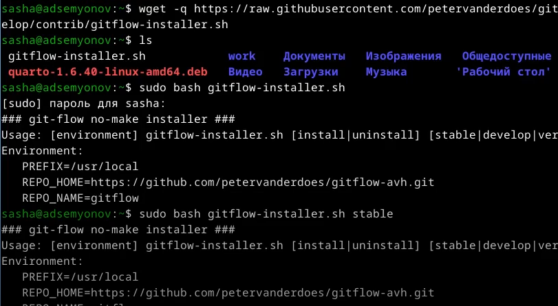{#fig-001 width=80%}

---

Далее я установил Node.js ([рис. @fig-002]).

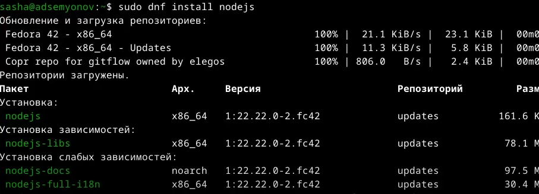{#fig-002 width=70%}

---

Я запустил pnpm setup и выполнил source ~/.bashrc ([рис. @fig-003]).

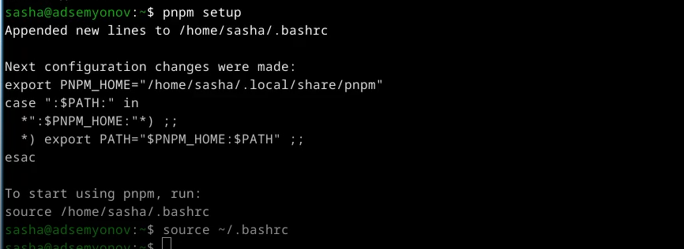{#fig-003 width=80%}

---

Я установил пакет commitizen ([рис. @fig-004]).

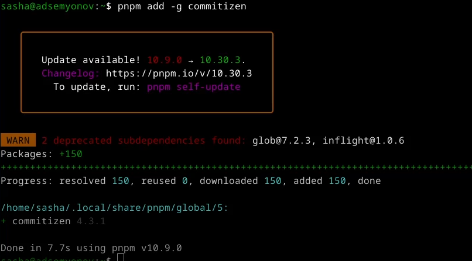{#fig-004 width=80%}

---

И скачал программу, которая используется для помощи в создании логов ([рис. @fig-005]).

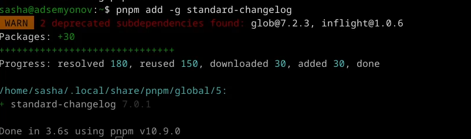{#fig-005 width=80%}

## Практический сценарий использования git

Я создал репозиторий на GitHub и назвал его git-extended ([рис. @fig-006]).

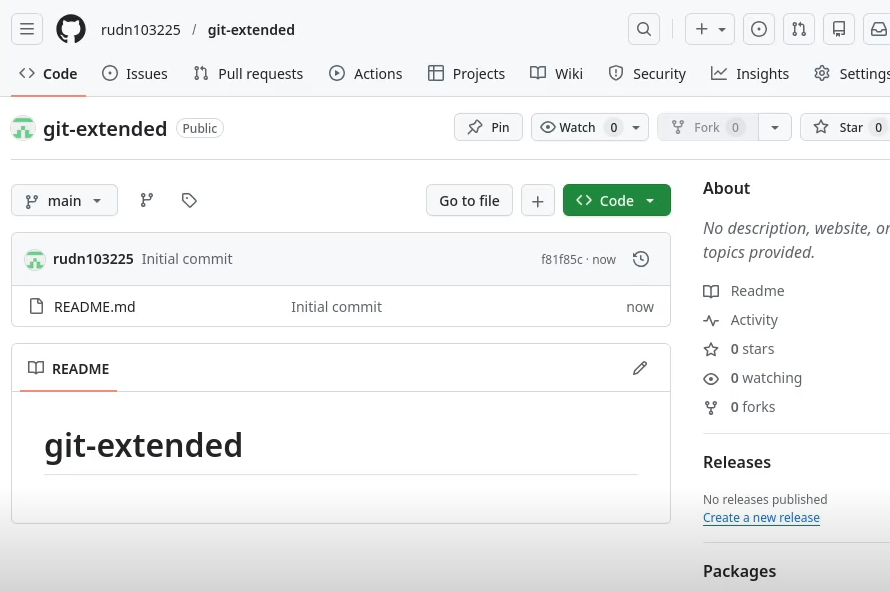{#fig-006 width=70%}

---

Перешел в созданный каталог и выполнил первый коммит, но поскольку не было никаких изменений, выдало : нечего комитить ([рис. @fig-007]).

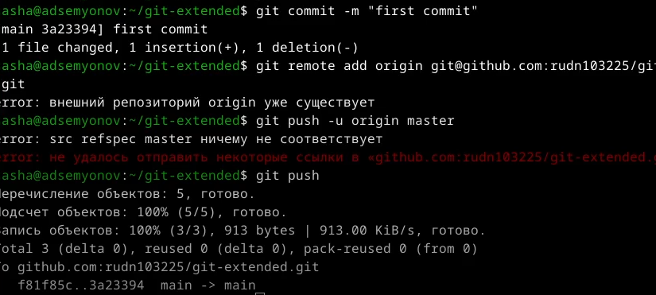{#fig-007 width=80%}

---

После этого я перешел к конфигурации для пакетов Node.js ([рис. @fig-008]).

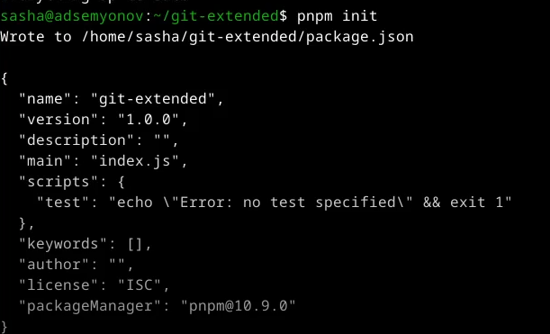{#fig-008 width=80%}

---

Изменил текст в файле package.json, добавив в него команду для формирования коммитов ([рис. @fig-009]).

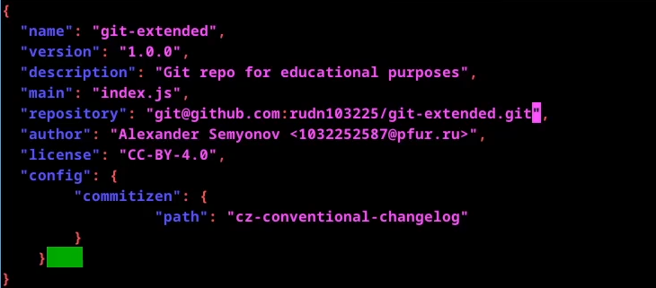{#fig-009 width=80%}

---

Добавил новые файлы, выполнил коммит и отправил на GitHub ([рис. @fig-010]).

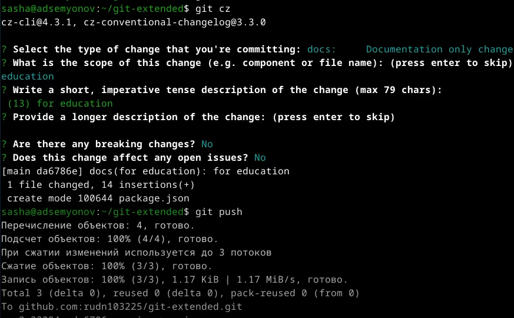{#fig-010 width=70%}

---

Далее я инициализировал git-flow, установил префикс для ярлыков -v, проверил, что нахожусь на ветке develop и загрузил весь репозиторий в хранилище ([рис. @fig-011]).

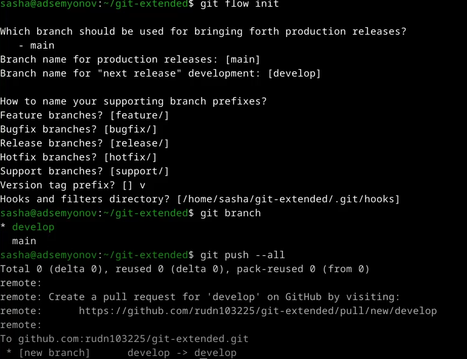{#fig-011 width=60%}

---

Я установил внешнюю ветку как вышестоящую для этой ветки и создал релиз с версией 1.0.0 ([рис. @fig-012]).

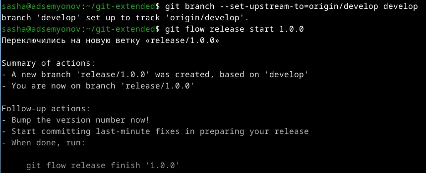{#fig-012 width=80%}

---

Создал журнал изменений, добавил журнал изменений в индекс и залил релизную ветку в основную ветку ([рис. @fig-014], [рис. @fig-015]).

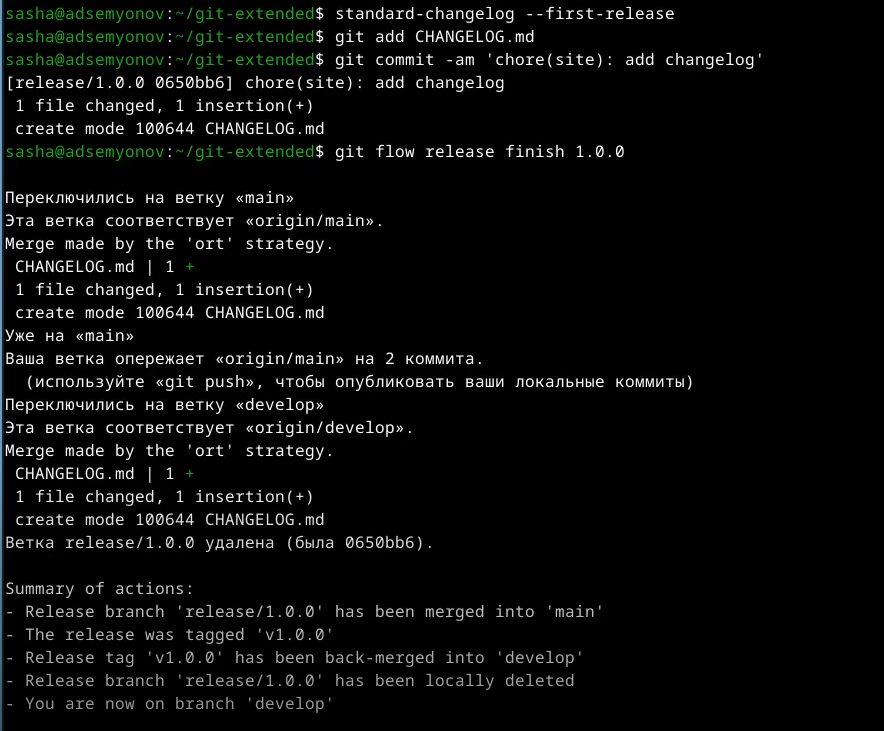{#fig-013 width=80%}

---

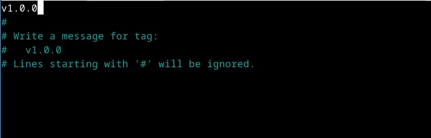{#fig-014 width=80%}

---

Отправил данные на GitHub и создал релиз на GitHub ([рис. @fig-015]).

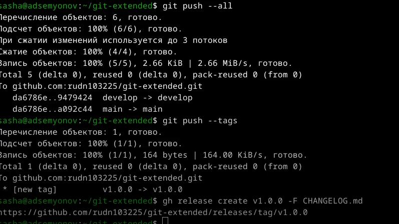{#fig-015 width=80%}

---

Я создал ветку для новой функциональности, проверил на какой я ветке и объединил ветки fearure_branch и develop ([рис. @fig-016]).

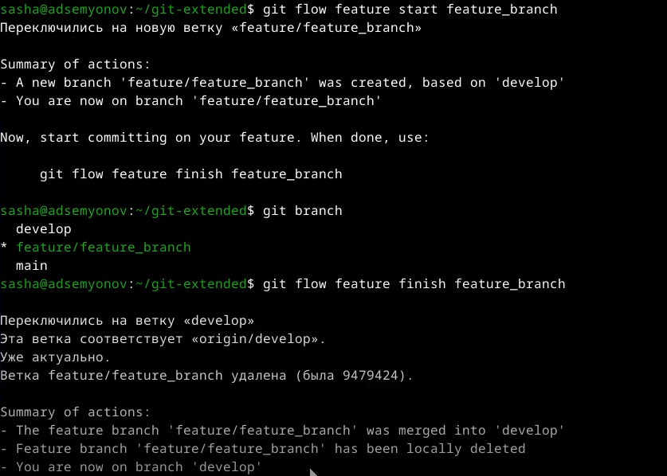{#fig-016 width=80%}

---

Создал релиз с версией 1.2.3 ([рис. @fig-017]).

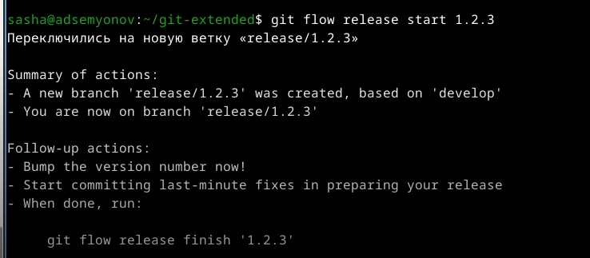{#fig-017 width=80%}

---

Обновил номер версии в файле package.json, установив её 1.2.3 ([рис. @fig-018]).

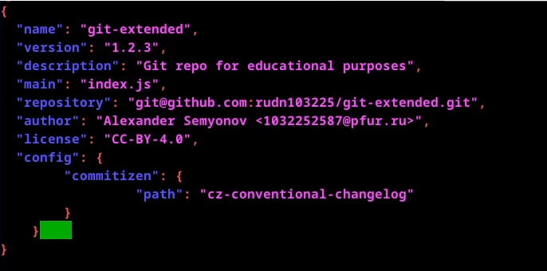{#fig-018 width=80%}

---

Создал журнал изменений и добавил журнал изменений в индекс ([рис. @fig-019]).

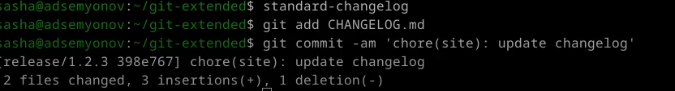{#fig-019 width=80%}

---

Залил релизную ветку в основную ветку ([рис. @fig-020], [рис. @fig-021]).

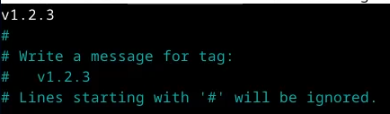{#fig-020 width=80%}

---

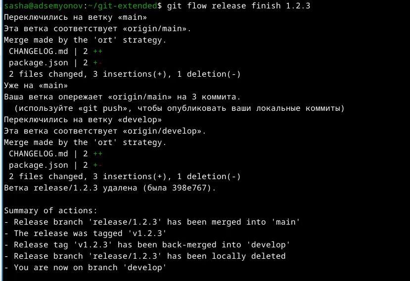{#fig-021 width=70%}

---

Я отправил данные на GitHub и создал релиз с комментарием из журнала изменений ([рис. @fig-022]).

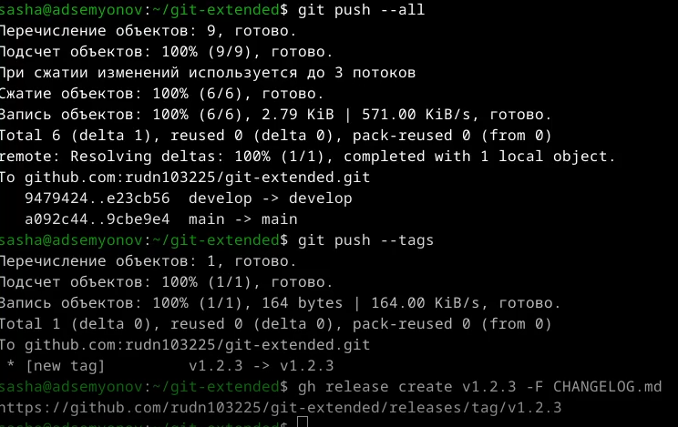{#fig-022 width=80%}

---

Проверил, что на GitHub видны изменения ([рис. @fig-023]).

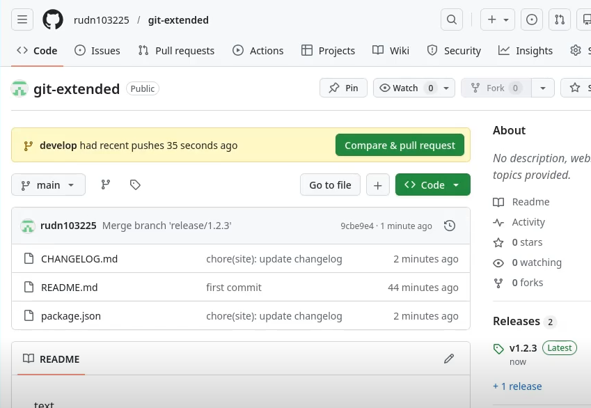{#fig-023 width=80%}

# Выводы

В процессе выполнения лабораторной работы я научился правильной работе с репозиториями git.

# Список литературы

[ТУИС](https://esystem.rudn.ru/)
