---
## Author
author:
  name: Семёнов Александр Дмитриевич
  degrees: Student
  email: 1032252587@rudn.ru
  affiliation:
    - name: Российский университет дружбы народов
      country: Российская Федерация
      postal-code: 117198
      city: Москва
      address: ул. Миклухо-Маклая, д. 6

## Title
title: "Лабораторная работа №4"
license: "CC BY"
---

# Цель работы

Получение навыков продвинутой работы с **git** и **релизами**.

# Задание

Выполнить работу для тестового репозитория и преобразовать рабочий репозиторий в репозиторий с **git-flow** и **conventional commits**.

# Теоретическое введение

Системы контроля версий (Version Control System, VCS) используются для организации совместной работы коллектива над общим проектом. Как правило, основная ветка разработки хранится в репозитории — локальном или удаленном, — к которому организован доступ всех участников. Когда разработчики вносят правки, VCS позволяет регистрировать эти изменения, объединять результаты работы разных специалистов, а при необходимости — выполнять возврат к любой из более ранних версий проекта.В классической модели контроля версий применяется централизованный подход: все файлы хранятся в едином репозитории, а управление версиями обеспечивается выделенным сервером. Участник проекта перед началом работы с помощью специальных команд запрашивает актуальную или нужную ему версию файлов. Завершив внесение правок, он отправляет обновлённую версию обратно в хранилище. При этом все предыдущие версии сохраняются в центральном репозитории, и к ним можно обратиться в любой момент. Чтобы экономить дисковое пространство, сервер может не сохранять полностью каждый изменённый файл, а применять дельта-компрессию — записывать только различия между последовательными версиями.Gitflow Workflow, семантическое версионирование и Conventional CommitsGitflow Workflow — это модель ветвления для Git, которая была опубликована и популяризована Винсентом Дриссеном. Данная модель предполагает выстраивание строгой структуры веток с учётом выпуска версий проекта. Gitflow Workflow отлично подходит для организации рабочего процесса, основанного на регулярных релизах. Работа по этой модели включает создание отдельных веток для разработки новых функций, подготовки релизов, а также для срочного исправления ошибок в рабочей среде, что позволяет поддерживать стабильность основной ветки проекта на всех этапах разработки.Семантическое версионирование, или SemVer, описывается в одноимённом манифесте и представляет собой систему правил для присвоения номеров версий. Кратко его можно описать следующим образом: версия задаётся в виде кортежа МАЖОРНАЯ_ВЕРСИЯ.МИНОРНАЯ_ВЕРСИЯ.ПАТЧ. Номер версии следует увеличивать по определённым правилам. МАЖОРНУЮ версию увеличивают в том случае, когда в проект вносятся обратно несовместимые изменения API. МИНОРНУЮ версию увеличивают при добавлении новой функциональности, которая не нарушает обратной совместимости. ПАТЧ-версию увеличивают, когда выполняются обратно совместимые исправления ошибок. Дополнительные обозначения для предрелизных версий и билд-метаданных могут быть добавлены как расширение к основному формату МАЖОРНАЯ.МИНОРНАЯ.ПАТЧ, например, в виде суффиксов -alpha, -beta или +build.15.Спецификация Conventional Commits представляет собой соглашение о том, как нужно писать сообщения коммитов. Данная спецификация полностью совместима с семантическим версионированием и даже более того — она тесно с ним связана. Conventional Commits регламентирует структуру сообщения коммита и определяет основные типы изменений, такие как feat для новой функциональности, fix для исправления ошибок, BREAKING CHANGE для изменений, нарушающих обратную совместимость, а также вспомогательные типы вроде docs, style, refactor и другие. Соблюдение этой специnebcфикации позволяет автоматически определять следующую версию проекта в соответствии с правилами SemVer, а также генерировать changelog на основе истории коммитов, что значительно упрощает управление версиями и выпуск релизов.

# Выполнение лабораторной работы

## Установка репозиториев.

Установка из колекции репозиториев **Corp** ([рис. @fig-001]). ([рис. @fig-002]).

{#fig-001 width=70%}

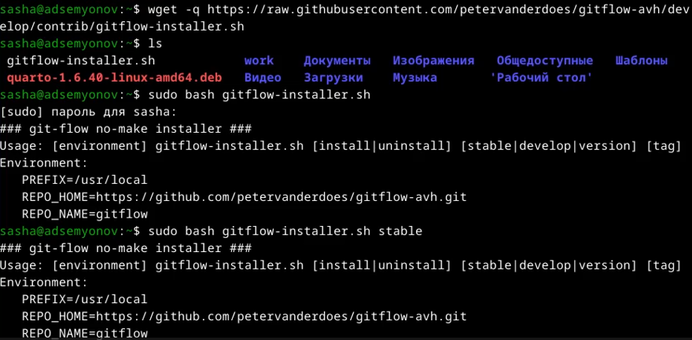{#fig-002 width=70%}

Установка **node.js** ([рис. @fig-003]).

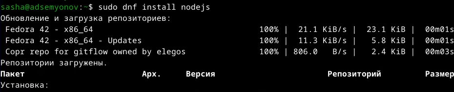{#fig-003 width=70%}

Установка **pnpm** ([рис. @fig-004]).

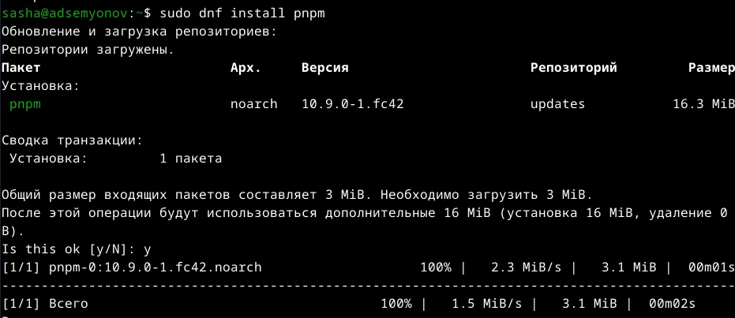{#fig-004 width=70%}

Выполним **source~/.bashrc** ([рис. @fig-005]).

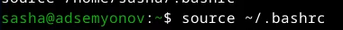{#fig-005 width=70%}

## Общепринятые коммиты.

Данную комнаду мы выполняем дл помощи в форматировании коммитов ([рис. @fig-006)]).

{#fig-006 width=70%}

Выполним команды для помощи в создании логов ([рис. @fig-007]).

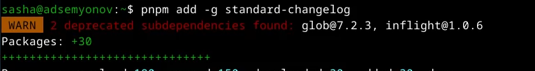{#fig-007 width=70%}

## Создание репозитория git.

Создадим репозиторий на **GitHub** и назовем его **git-extended** ([риc. @fig-008]).

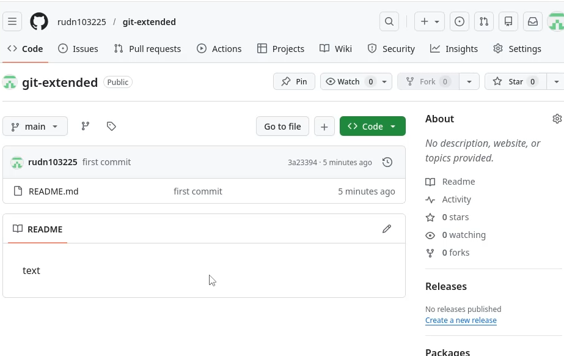{#fig-008 width=70%}

Делаем первый коммит и выкладываем на **GitHub** ([рис. @fig-009]).

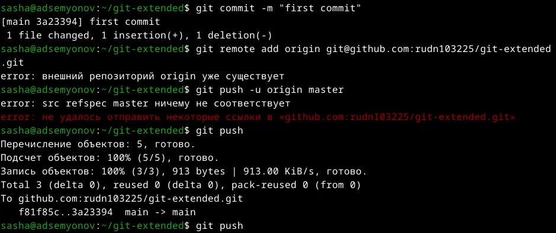{#fig-009 width=70%}

Конфигурация общепринятых коммитов ([рис. @fig-010]).

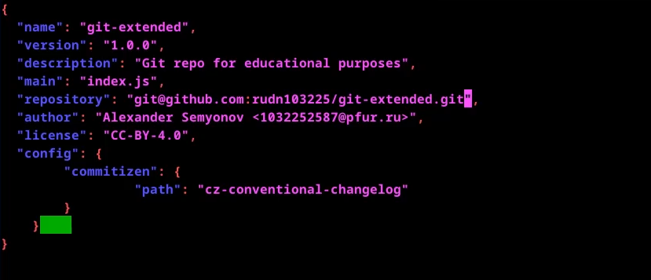{#fig-010 width=70%}

Добавим новые файлы ([рис. @fig-011]).

{#fig-011 width=70%}

Выполним коммит ([рис. @fig-012]).

{#fig-012 width=70%}

Отправим на **GitHub** ([рис. @fig-013]).

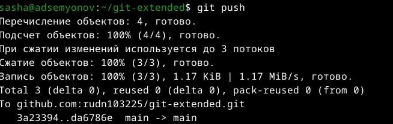{#fig-013 width=70%}

## Конфигурация git flow.

Инициализируем **git flow** ([рис. @fig-014]).

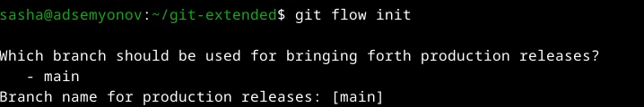{#fig-014 width=70%}

Проверяем, что мы на ветке **develop** ([рис. @fig-015]).

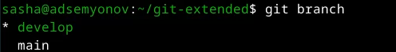{#fig-015 width=70%}

Загрузка всего репозитория в хранилище ([рис. @fig-016]).

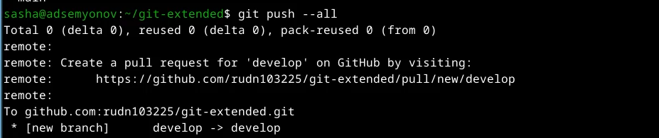{#fig-016 width=70%}

Установим внешнюю ветку как вышестоящую для этой ветки ([рис. @fig-017]).

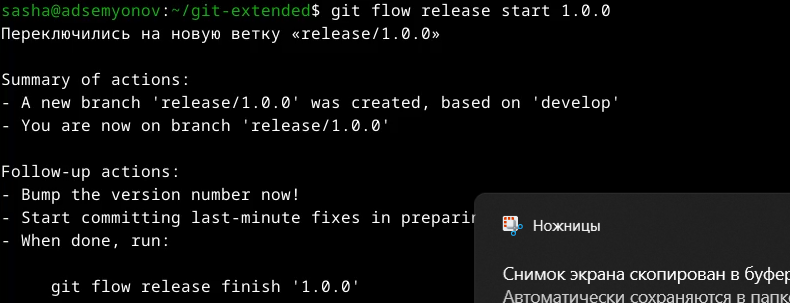{#fig-017 width=70%}

Созданем релиз с версией **1.0.0** ([рис. @fig-018]).

{#fig-018 width=70%}

Создадим журнал изменений ([рис. @fig-019]).

{#fig-019 width=70%}

Добавим журнал изменений в индекс ([рис. @fig-020]).

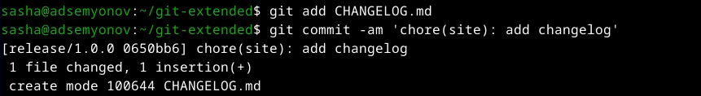{#fig-020 width=70%}

Зальём релизную ветку в основную ветку ([рис. @fig-021]).

{#fig-021 width=70%}

Отправим данные на **GitHub** ([рис. @fig-22]). ([рис. @fig-23]).

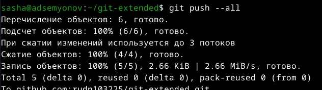{#fig-022 width=70%}

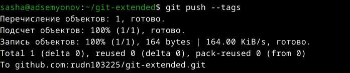{#fig-023 width=70%}

Создадим релиз на **GitHub**, а для этого будем использовать утилиты с **GitHub**. ([рис. @fig-024]).

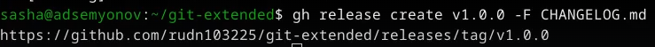{#fig-024 width=70%}

## Работа с репозиторием git.

Создадим ветку для новой функциональности ([рис. @fig-025]).

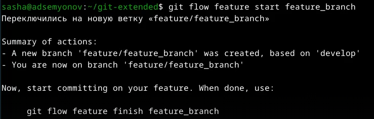{#fig-025 width=70%}

Затем продолжаеем работу как обычно ([рис. @fig-026]).

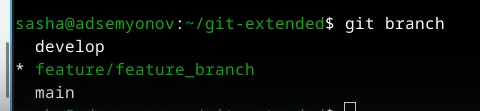{#fig-026 width=70%}

По окончанию разработки новой функциональности слудющим шагом следует объеденить ветку **feature_branch** с **develop** ([рис. @fig-027]).

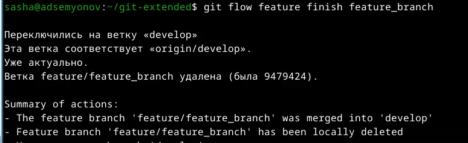{#fig-027 width=70%}

Создадим релиз, но уже с версией **1.2.3** ([рис. @fig-028]).

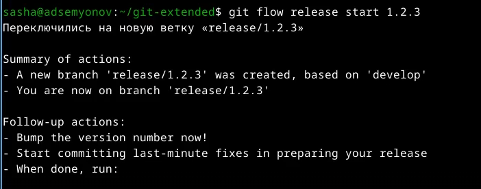{#fig-028 width=70%}

Нужно обновить номер **version** на **1.2.3** в файле **package.json** ([рис. @fig-029]).

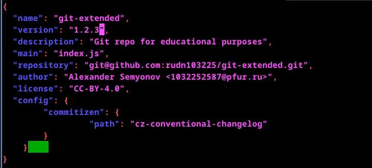{#fig-029 width=70%}

Создаем журнал изменений ([рис. @fig-030]).

{#fig-030 width=70%}

Добавим журнал изменений ([рис. @fig-031]).

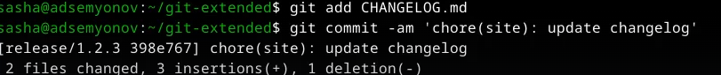{#fig-031 width=70%}

Зальём релизную ветку в основную ветку ([рис. @fig-032]).

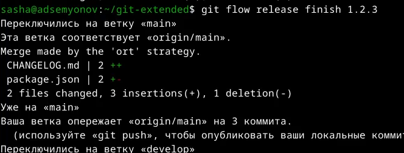{#fig-032 width=70%}

Отправим данные на **GitGub** ([рис. @fig-033]). ([рис. @fig-034]).

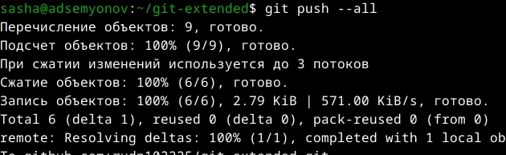{#fig-033 width=70%}

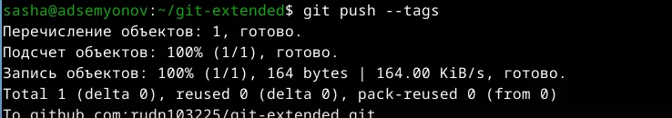{#fig-034 width=70%}

Создадим релиз на **GitHub** с комментарием из журнала изменений ([рис. @fig-035]).

{#fig-035 width=70%}

# Выводы

В ходе выполнения лабораторной работы я получила навыки работы с репозиториями **git**.

# Список литературы{.unnumbered}
[ТУИС](https://esystem.rudn.ru/)
