---
## Author
author:
  name: Семёнов Александр Дмитриевич
  degrees: Student
  email: 1032252587@rudn.ru
  affiliation:
    - name: Российский университет дружбы народов
      country: Российская Федерация
      postal-code: 117198
      city: Москва
      address: ул. Миклухо-Маклая, д. 6

## Title
title: "Отчёт по лабораторной работе №5"
subtitle: "Дисциплина: Операционные системы"
license: "CC BY"
---

# Цель работы

Освоить использование менеджера паролей pass для безопасного хранения учётных данных и систему управления кофигурацинными файлами chezmoi для синхронизации настроек рабочей среды.

# Задание
 
 * Установить и настроить менеджер паролей pass
 
 * Установить и настроить chezmoi
 
 * Выполнить настройку второй машины/компьютера с использованием созданного репозитория

# Теоретическое введение

## Менеджер паролей pass

pass (The standard Unix password manager) — менеджер паролей, следующий философии Unix. Основные принципы работы:

- Хранение данных: пароли сохраняются в файловой системе в виде обычных файлов, организованных в каталоги.

- Безопасность: каждый файл шифруется с помощью GPG-ключа пользователя.

- Структура базы: может быть произвольной, но для совместимости с дополнительным ПО рекомендуется семантическая структура (например, example.com/user.gpg, user@example.com.gpg).

- Синхронизация: поддерживается работа с Git, что позволяет хранить базу паролей в удалённом репозитории и использовать её на нескольких устройствах.

## Управление конфигурационными файлами с chezmoi

chezmoi — инструмент для управления dotfiles (конфигурационными файлами) в домашнем каталоге пользователя.

Основные возможности:

- Хранение: состояние файлов сохраняется в ~/.local/share/chezmoi, который является клоном Git-репозитория.

- Шаблоны: поддержка шаблонов Go (синтаксис {{ .variable }}) для создания конфигураций, адаптируемых под разные машины.

- Переменные: доступ к данным окружения через chezmoi data (ОС, имя хоста, архитектура и др.).

- Условные выражения: возможность включать/исключать части конфигурации в зависимости от условий (if, eq, and, or).
- Безопасность: отделение общих конфигураций от чувствительных данных (пароли, токены) с помощью шаблонов и внешних хранилищ секретов.

- Работа с несколькими машинами: простая инициализация новой машины одной командой (chezmoi init --apply), автоматическая синхронизация изменений.

# Выполнение лабораторной работе 

## **Менеджер паролей pass**

## Установка

Я установил pass ([рис. @fig-001]).

{#fig-001 width=80%}

А также gopass ([рис. @fig-002]).

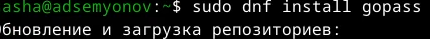{#fig-002 width=80%}

## Настройка

Посмотрел список ключей ([рис. @fig-003]).

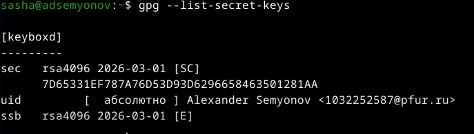{#fig-003 width=80%}

Инициализировала хранилище ([рис. @fig-004]).

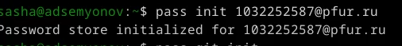{#fig-004 width=80%}

Создал структуру git и задал адрес репозитория на хостинге, предварительно создав репозиторий ([рис. @fig-005]).

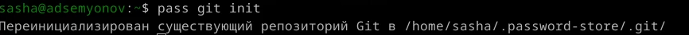{#fig-005 width=80%}

Выполнил следующую команду для синхронизации ([рис. @fig-006]).

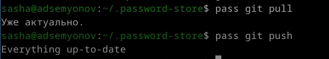{#fig-006 width=80%}

## Настройка интерфейса с браузером

Я установил интерфейс для взаимодейтсвия с браузером ([рис. @fig-007]).

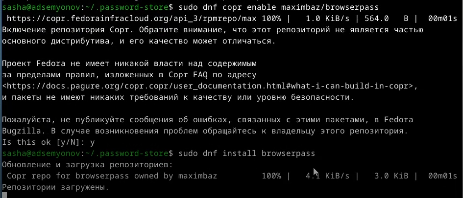{#fig-007 width=80%}

## **Дополнительное программное обеспечение**

Я установил дополнительное программное обеспечение ([рис. @fig-008]).

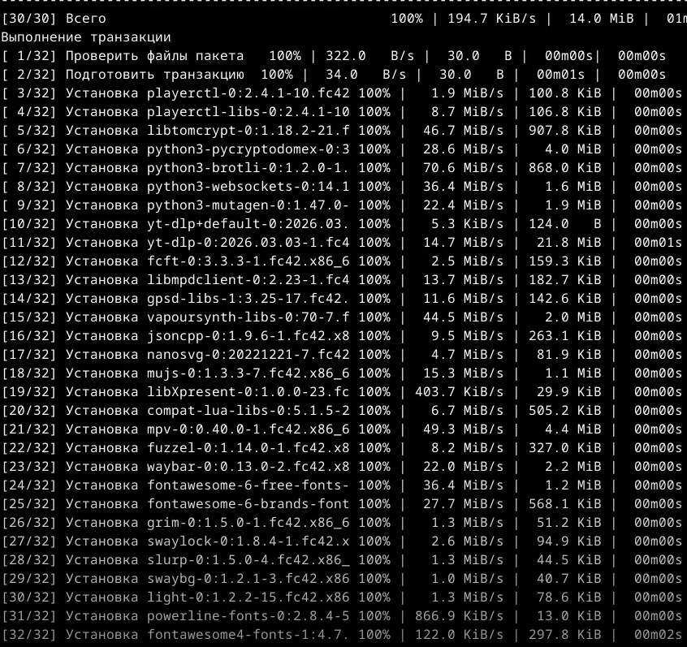{#fig-008 width=80%}

## Установка

С помощью wget скачивается необходимый файл ([рис. @fig-009]).

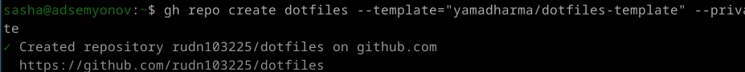{#fig-009 width=80%}

## Подключение репозитория к своей системе 

Далее инициализировал chezmoi с моим репозиторием dotfiles ([рис. @fig-010]).

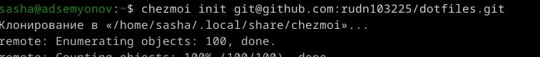{#fig-010 width=80%}

И проверил какие изменения внесет chezmoi в домашний каталог ([рис. @fig-011]).

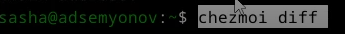{#fig-011 width=80%}

Запустил chezmoi apply -v, поскольку меня устраивают изменения ([рис. @fig-012]).

{#fig-012 width=80%}

## Ежедневные операции с chezmoi

Я извлекл изменения из репозитория и применила их. Потом извлекл изменения и посмотрел, что изменится, фактически не применяя изменения. И т.к. я доволен изменениями, я применил их ([рис. @fig-013]).

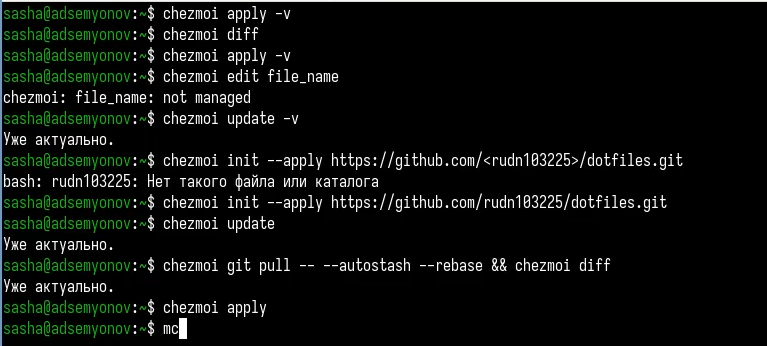{#fig-013 width=80%}

Чтобы автоматически фиксировать и отправлять изменения в репозиторий, я добавил в файл конфигурации ~/.config/chezmoi/chezmoi.toml следующее: ([рис. @fig-014]).

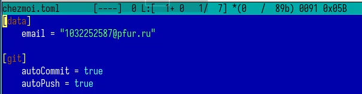{#fig-014 width=80%}

# Выводы

Я освоил использование менеджера паролей зфыы для безопасного хранения учётных данных и систему управления кофигурацинными файлами chezmoi для синхронизации настроек рабочей среды.

# Список литературы

[ТУИС](https://esystem.rudn.ru/)

