---
## Author
author:
  name: Семёнов Александр Дмитриевич
  degrees: Student
  email: 1032252587@rudn.ru
  affiliation:
    - name: Российский университет дружбы народов
      country: Российская Федерация
      postal-code: 117198
      city: Москва
      address: ул. Миклухо-Маклая, д. 6

## Title
title: "Отчёт по лабораторной работе №6"
subtitle: "Дисциплина: Операционные системы"
license: "CC BY"
---

# Цель работы

Приобрести практические навыки взаимодействия пользователя с системой посредством командной строки.

# Задание

* Исследовать содержимое каталога /tmp и домашнего каталога с помощью команды ls с различными опциями

* Создать и удалить каталоги 

* Изучить команды с помощью man

# Теоретическое введение
 
**Командная строка**

В ОС Linux взаимодействие с системой осуществляется через командную строку с помощью командных интерпретаторов shell (/bin/sh, /bin/csh, /bin/ksh).
 
**Формат команды:**

`<имя_команды> <аргументы>`
 
**Основные команды:**
 
*   `man <команда>` — просмотр руководства (q — выход, Space — страница вперёд)
*   `cd [путь]` — переход в каталог (`cd ..` — на уровень выше, `cd` — домой)
*   `pwd` — показать текущий путь
*   `ls [опции] [путь]` — просмотр содержимого каталога
 
    *   `-a` — показать скрытые файлы
    *   `-l` — подробная информация (владелец, права, размер)
    *   `-F` — показать типы файлов (/ — каталог, * — исполняемый)
    *   `-R` — просмотр подкаталогов
    *   `-t` — сортировка по времени
 
*   `mkdir [опции] имя` — создание каталога
    *   `-p` — создать родительские каталоги
    *   `-v` — подробный вывод
 
*   `rmdir имя` — удалить пустой каталог
*   `rm [опции] файл` — удалить файл/каталог
    *   `-r` — рекурсивно (для каталогов)
    *   `-f` — принудительно
 
*   `history` — показать историю команд
    *   `!<номер>` — выполнить команду по номеру

# Выполнение лабораторной работы

1. Я определил полное имя моего домашнего каталога ([рис. @fig-001]).

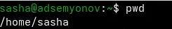{#fig-001 width=80%}

2. Выполнил следующие действия:

2.1 Перешла в каталог /tmp ([рис. @fig-002]).

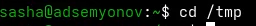{#fig-002 width=80%}

2.2 Вывел на экран содержимое каталога /tmp. ([рис. @fig-003], [рис. @fig-004], [рис. @fig-005]).

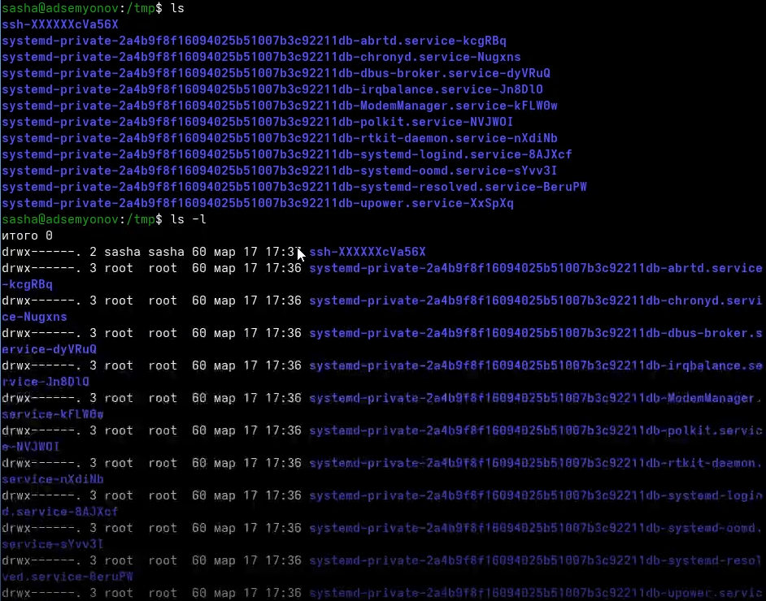{#fig-003 width=80%}

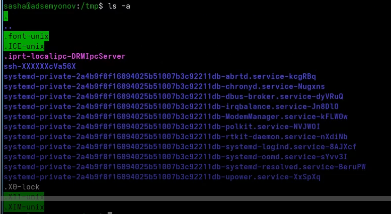{#fig-004 width=80%}

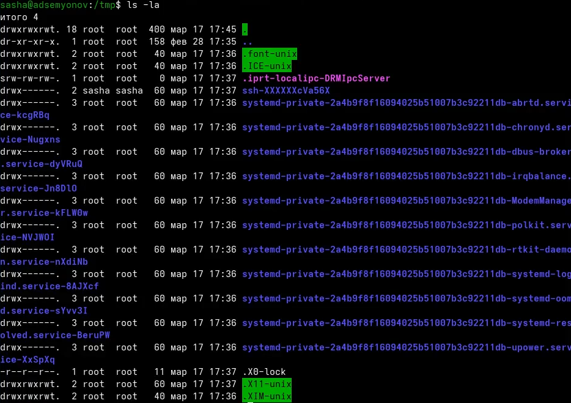{#fig-005 width=80%}

**ls**

Показывает:

* Только нескрытые файлы (без точки в начале)

* Только имена файлов 

* нет текущего (.) и родительского (..) каталогов 

**ls -l**

Показывает:

* Только нескрытые файлы (без точек в начале)

* Подробная информация (права доступа, владелец, группа, размер, дата)

* нет текущего (.) и родительского (..) каталогов
   
**ls -a**

Показывает:

* Все файлы (включая скрытые с точкой)

* Только имена файлов 

* Есть текущий (.) и родительский (..) каталоги

**ls -la**

Показывает:

* Все файлы

* Подробная информация (права доступа, владелец, группа, размер, дата)

* Есть текущий (.) и родительский (..) каталоги

2.3 Я проверил, что в каталоге /var/spool есть подкаталог с именем cron ([рис. @fig-006]).

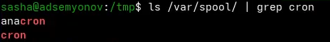{#fig-006 width=80%}

2.4 Перешел в мой домашний каталог и вывел его содержимое ([рис. @fig-007]).

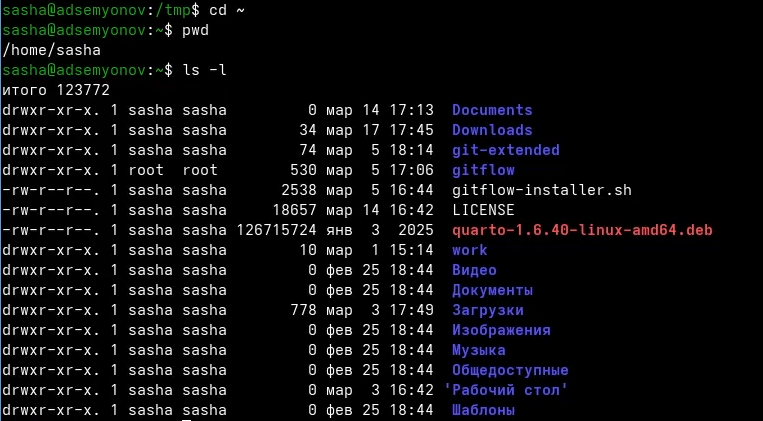{#fig-007 width=80%}

3. Я выполнил следующие действия:

3.1 В домашнем каталоге создал новый каталог с именем newdir ([рис. @fig-008]).

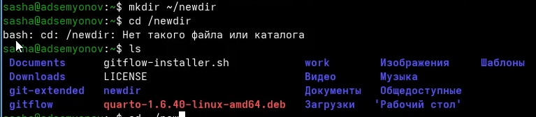{#fig-008 width=80%}

3.2 В каталоге ~/newdir я создал новый каталог с именем morefun ([рис. @fig-009]).

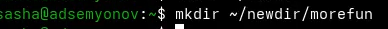{#fig-009 width=80%}

3.3 В домашнем каталоге создал одной командной три новых каталога с именами letters, memos, misk ([рис. @fig-010]).

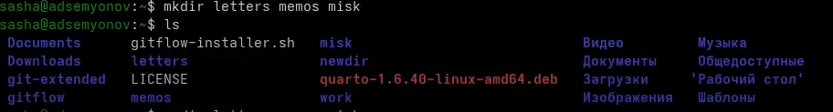{#fig-010 width=80%}

3.4 Затем удалил их одной командой ([рис. @fig-011]).
 
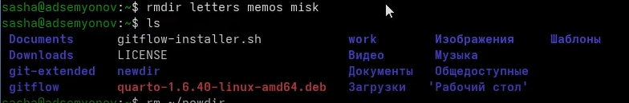{#fig-011 width=80%}

3.5 Я удалил каталог ~/newdir/morefun из домашнего каталога. Он был удален  ([рис. @fig-012]).

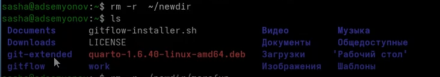{#fig-012 width=80%}

4. С помощью команды man я определил, какую опцию команды ls нужно использовать для просмотра содержимогго не только указанного каталога, но и подкаталогов, входящих в него. Это опция -R ([рис. @fig-013]).

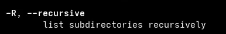{#fig-013 width=80%}

6. Я использовал команду man для просмотра описания следующих команд: cd, pwd, mkdir, rmdir, rm ([рис. @fig-014)].

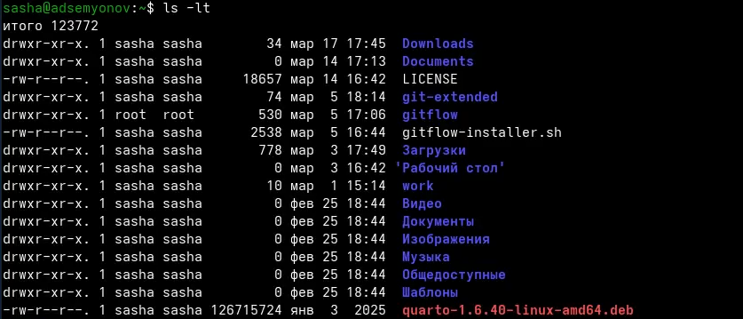{#fig-014 width=80%}

Основные опции этих команд:

**cd**

cd переход в домашний каталог

cd .. переход на уровень выше

cd -  переход в предыдущий каталог

cd /путь переход по абсолютному пути

cd папка переход в подкаталог

**pwd**

pwd показать текущий каталог

pwd -P показать физический путь без символьных ссылок

pwd -L показать путь с учётом символьных ссылок

**mkdir**

mkdir dir создать каталог

mkdir -p path/to/dir создать родительские каталоги

mkdir -v dir показать сообщение о создании

mkdir -m 755 dir установить права доступа

mkdir dir1 dir2 dir3 создать несколько каталогов

**rmdir**

rmdir dir удалить пустой каталог

rmdir -p path/to/dir удалить каталог и родительские

rmdir -v dir показать сообщение об удалении
text

**rm**

rm file удалить файл

rm -r dir удалить каталог рекурсивно

rm -f file принудительно без подтверждения

rm -i file запрашивать подтверждение

rm -v file показать подробности удаления

rm -rf dir рекурсивно + принудительно

7. Используя информацию, полученную при помощи команды history, я выполнил модификацию и исполнение команды из буфера команд ([рис. @fig-015],[рис. @fig-016]).

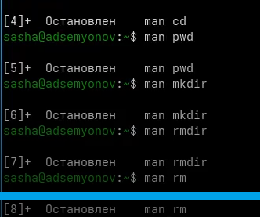{#fig-015 width=80%}

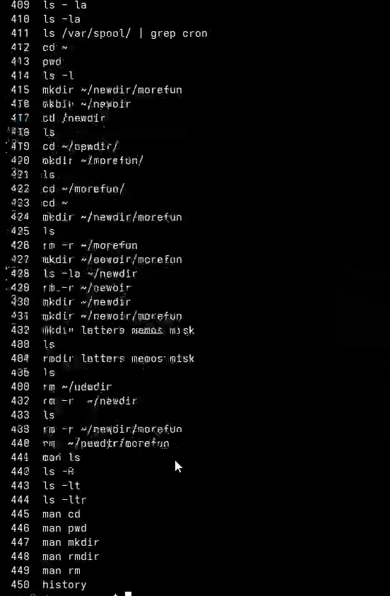{#fig-016 width=80%}

# Выводы

В ходе выполнения лабораторной работы я приобрел практические навыки взаимодействия пользователя с системой посредством командной строки.

# Список литературы

[ТУИС](https://esystem.rudn.ru/course)
