---
## Author
author:
  name: Семёнов Александр Дмитриевич
  degrees: Student
  orcid: 0000-0002-0877-7063
  email: 1032252587@rudn.ru
  affiliation:
    - name: Российский университет дружбы народов
      country: Российская Федерация
      postal-code: 117198
      city: Москва
      address: ул. Миклухо-Маклая, д. 6

## Title
title: "Отчёт по лабораторной работе №8"
subtitle: "Дисциплина: Операционные системы"
license: "CC BY"
---

# Цель работы

 Ознакомиться с инструментами поиска файлов и фильтрации текстовых данных.
Приобрести практических навыков: по управлению процессами (и заданиями), по
проверке использования диска и обслуживанию файловых систем

# Задание

* Выполнить перенаправление потоков ввода-вывода и фильтрацию текстовых
данных.

* Осуществить поиск файлов, запуск процессов в фоновом режиме и управление ими.

* Изучить использование дискового пространства и получить справочную информацию
о командах.

# Теоретическое введение

## Перенаправление ввода-вывода

- В Linux существует три стандартных потока:

- `stdin` (ввод, по умолчанию — клавиатура), файловый дескриптор 0

- `stdout` (вывод, по умолчанию — консоль), файловый дескриптор 1

- `stderr` (вывод ошибок, по умолчанию — консоль), файловый дескриптор 2

- Символ `>` перенаправляет `stdout` в файл (файл создаётся или
перезаписывается)

- Символ `>>` перенаправляет `stdout` в файл в режиме добавления (данные
дописываются в конец)

- Символы `2>` и `2>>` служат для перенаправления `stderr`

- Символ `&>` перенаправляет и `stdout`, и `stderr` в один файл

## Конвейер (pipe)
- Конвейер (`|`) позволяет объединять несколько команд в цепочку

- Вывод предыдущей команды передаётся на ввод следующей

- Синтаксис: `команда1 | команда2`

## Поиск файлов (команда `find`)

- Команда `find` ищет файлы и каталоги, соответствующие заданным критериям

- Формат: `find путь [опции]`

- Поиск ведётся в указанном каталоге и всех его подкаталогах

- Пример: `find ~ -name "f*" -print` — найти все файлы, начинающиеся на "f", в
домашнем каталоге

## Фильтрация текста (команда `grep`)

- Команда `grep` ищет строки, содержащие заданный образец

- Формат: `grep строка имя_файла`- Может обрабатывать стандартный вывод других команд через конвейер

- Пример: `ls -l | grep lab`
 
## Проверка использования диска (`df` и `du`)

- `df` — показывает размер каждого смонтированного раздела диска

- `du` — показывает количество килобайт, используемое каждым файлом или
каталогом

- Пример: `df -h`, `du -sh ~`

## Управление задачами и процессами

- Символ `&` в конце команды запускает процесс в **фоновом режиме**

- `jobs` — выводит список запущенных в данный момент задач

- `kill %номер_задачи` — завершает указанную задачу

- `ps aux` — выводит информацию о процессах

- Каждому процессу присваивается уникальный идентификатор — **PID**

# Выполнение лабораторной работы

1. Я осуществил вход в систему, используя соответствующее имя пользователя.

2. Я записала в файл file.txt названия файлов, содержащихся в каталоге /etc ([рис. @fig-001]).

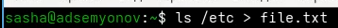{#fig-001 width=70%}

Дописал в этот же файл названия файлов, содержащихся в моем домашнем каталог ([рис. @fig-002]).

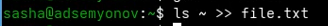{#fig-002 width=70%}

3. Я вывел имена всех файлов из file.txt, имеющих расширение .conf ([рис. @fig-003]).

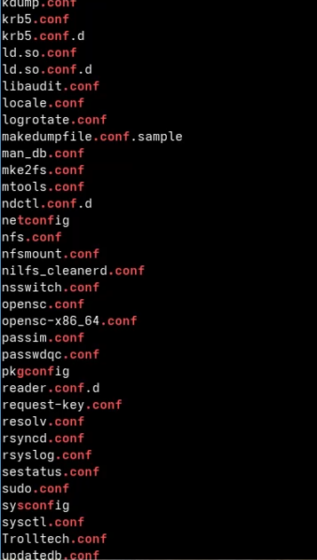{#fig-003 width=70%}

После чего записал их в новый текстовой файл conf.txt ([рис. @fig-004]).

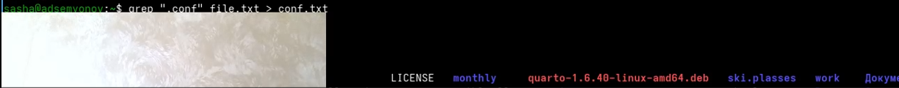{#fig-004 width=70%}

4. Я определил, какие файлы в моем домашнем каталоге имеют имена, начинавшиеся
с символа c

* Через find ([рис. @fig-005]).

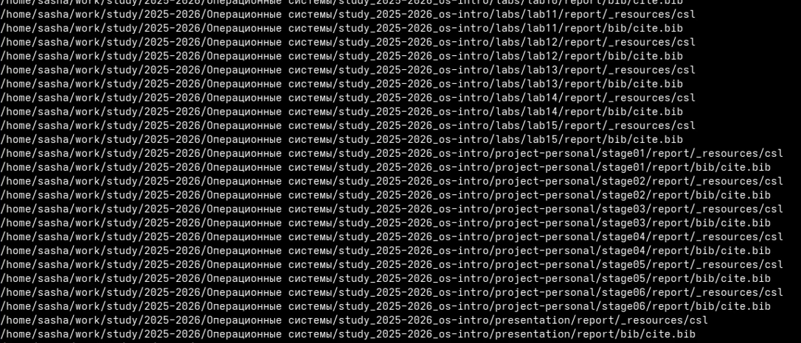{#fig-005 width=70%}

* Через ls ([рис. @fig-006]).

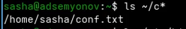{#fig-006 width=70%}

5. Вывел на экран (по странично) имена файлов из каталога /etc, начинающиеся
с символа h ([рис. @fig-007]).

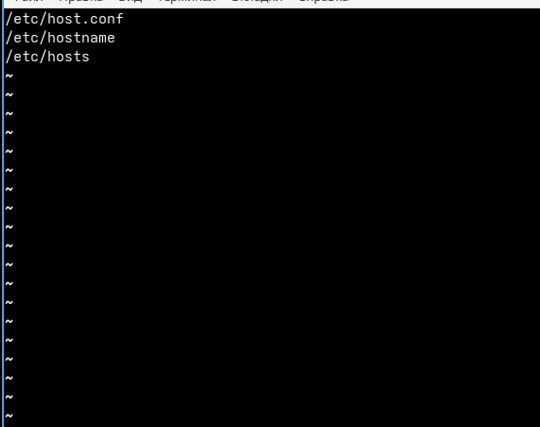{#fig-007 width=70%}

6-7. Я запустил в фоновом режиме процесс, который будет записывать в файл ~/logfile
файлы, имена которых начинаются с log. И удалил файл ~/logfile ([рис. @fig-008]).

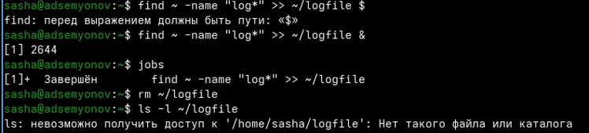{#fig-008 width=70%}

8-9. Я запустил из консоли в фоновом режиме редактор gedit и определила идентификатор процесса gedit, используя команду ps, конвейер и фильтр grep ([рис. @fig-009]). 

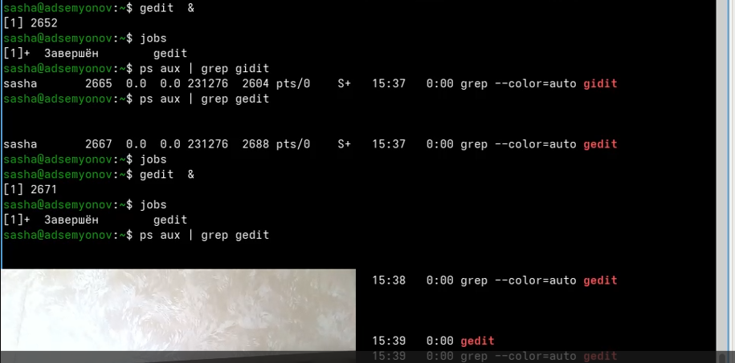{#fig-009 width=70%}

10. Я прочитал справку (man) команды kill, после чего использовала её для завершения
процесса gedit ([рис. @fig-010], [рис. @fig-011]).

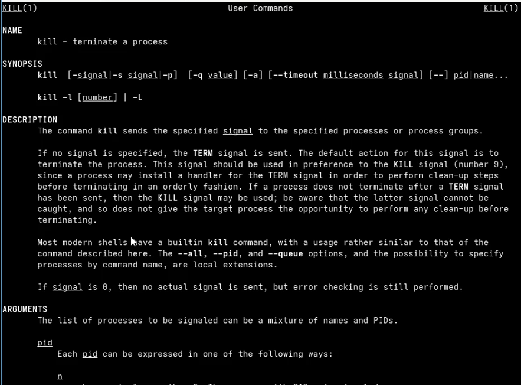{#fig-010 width=70%}

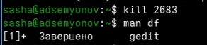{#fig-011 width=70%}

11. Я выполинил команды df и du, предварительно получив более подробную информацию
об этих командах, с помощью команды man ([рис. @fig-012], [рис. @fig-013]).

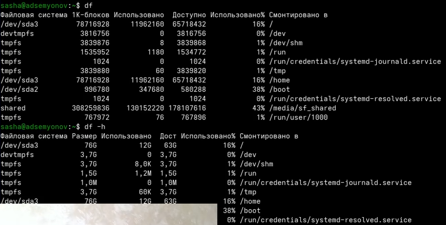{#fig-012 width=70%}

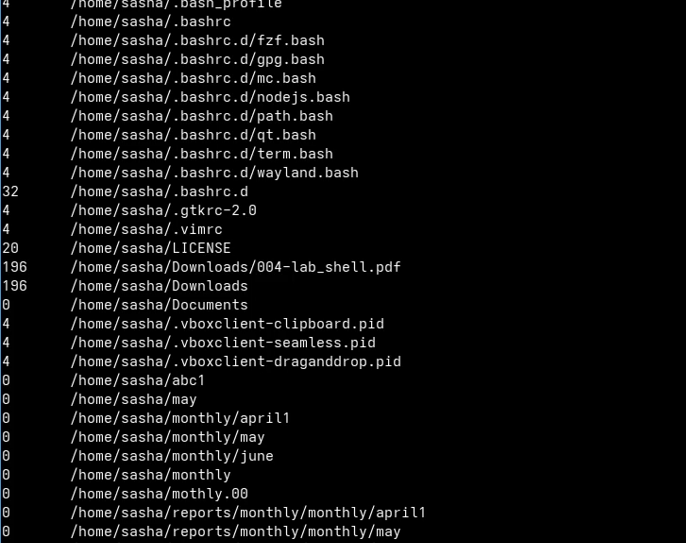{#fig-013 width=70%}

# Выводы

В ходе выполнения лабораторной работы я ознакомилась с инструментами поиска файлов и фильтрации текстовых данных, приобрела практических навыков: по управлению процессами (и заданиями), по проверке использования диска и обслуживанию файловых систем

# Список литературы 

[ТУИС](https://esystem.rudn.ru)
